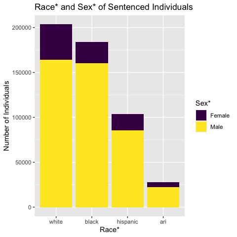
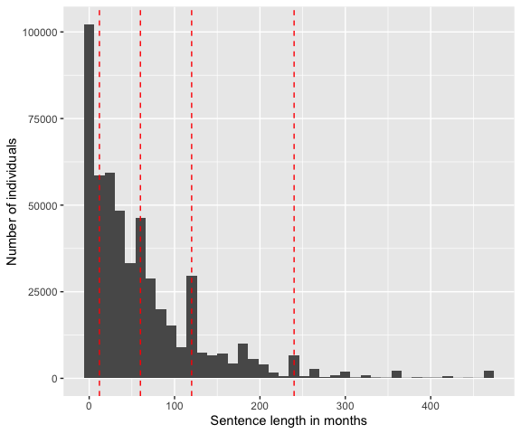
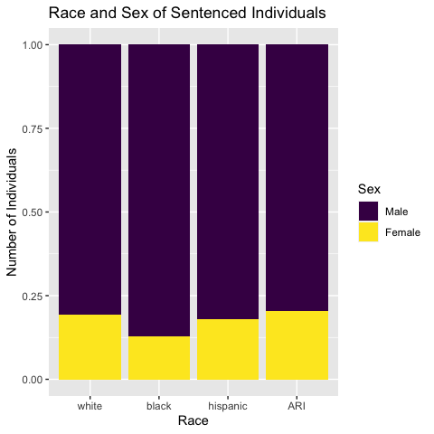
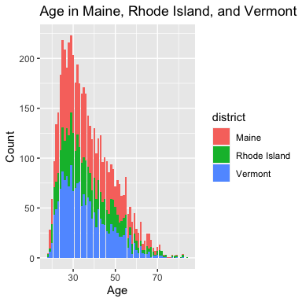
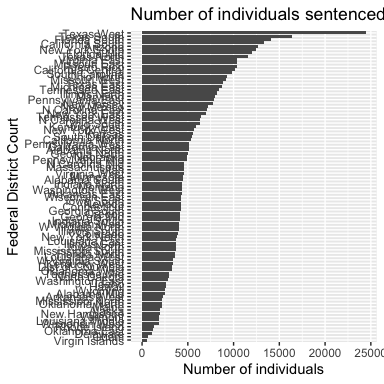
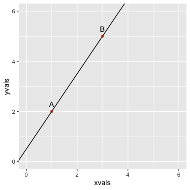
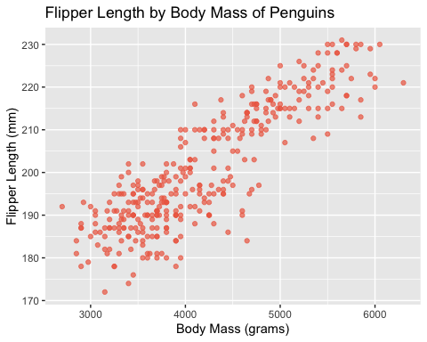
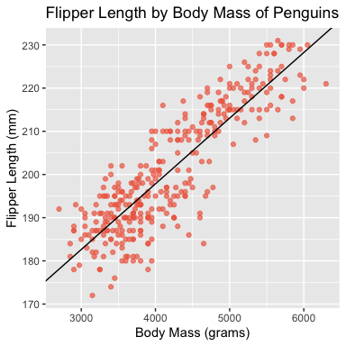
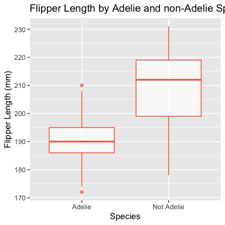

Federal District Courts and Race-Based Criminal Sentencing Disparities
================
Laurie Baker, Helen Grundman, Lily Khadjavi, Saeja Kim, Momin Malik,
Ariana Mendible, Omayra Ortega, José Pabón, Chad M. Topaz, Thomas
Wakefield
July 21, 2023

- <a href="#1-acknowledgments" id="toc-1-acknowledgments">1
  Acknowledgments</a>
- <a href="#2-background" id="toc-2-background">2 Background</a>
  - <a href="#21-reading-in-the-data" id="toc-21-reading-in-the-data">2.1
    Reading in the data</a>
  - <a href="#22-describe-the-structure-of-the-data"
    id="toc-22-describe-the-structure-of-the-data">2.2 Describe the
    structure of the data</a>
    - <a href="#who" id="toc-who">2.2.1 Who</a>
    - <a href="#222-what" id="toc-222-what">2.2.2 What</a>
    - <a href="#223-when" id="toc-223-when">2.2.3 When</a>
    - <a href="#224-where" id="toc-224-where">2.2.4 Where</a>
    - <a href="#225" id="toc-225">2.2.5</a>
    - <a href="#226" id="toc-226">2.2.6</a>
    - <a href="#227" id="toc-227">2.2.7</a>
  - <a href="#23-data-types" id="toc-23-data-types">2.3 Data Types</a>
    - <a href="#231-penguins-data" id="toc-231-penguins-data">2.3.1 Penguins
      Data</a>
  - <a href="#24-explorations" id="toc-24-explorations">2.4 Explorations</a>
  - <a href="#25-how-to-make-a-scatter-plot-with-quantitative-variables"
    id="toc-25-how-to-make-a-scatter-plot-with-quantitative-variables">2.5
    How to make a scatter plot with quantitative variables</a>
  - <a
    href="#26-what-happens-when-you-try-to-make-a-scatter-plot-with-categorical-variables"
    id="toc-26-what-happens-when-you-try-to-make-a-scatter-plot-with-categorical-variables">2.6
    What happens when you try to make a scatter plot with categorical
    variables?</a>
  - <a href="#27-fitting-lines-to-data"
    id="toc-27-fitting-lines-to-data">2.7 Fitting Lines to Data</a>
    - <a href="#271-analytically-fit-a-line-to-two-points"
      id="toc-271-analytically-fit-a-line-to-two-points">2.7.1 Analytically
      Fit a Line to Two Points</a>
    - <a href="#272-numerically-fit-a-line-to-two-points"
      id="toc-272-numerically-fit-a-line-to-two-points">2.7.2 Numerically Fit
      a Line to Two Points</a>
    - <a href="#273-numerically-fit-a-line-to-three-points"
      id="toc-273-numerically-fit-a-line-to-three-points">2.7.3 Numerically
      Fit a Line to Three Points</a>
  - <a href="#28-fitting-a-line-to-many-points-linear-regression"
    id="toc-28-fitting-a-line-to-many-points-linear-regression">2.8 Fitting
    a Line to Many Points: Linear Regression!</a>
  - <a href="#29-categorical-data-to-numerical-representations"
    id="toc-29-categorical-data-to-numerical-representations">2.9
    Categorical Data to Numerical Representations</a>
- <a href="#3-results" id="toc-3-results">3 Results</a>

------------------------------------------------------------------------

This work is governed under the [Creative Commons
Attribution-NonCommercial-ShareAlike 4.0 International
license](https://creativecommons.org/licenses/by-nc-sa/4.0/).

Citation: Laurie Baker, Helen Grundman, Lily Khadjavi, Saeja Kim, Momin
Malik, Ariana Mendible, Omayra Ortega, José Pabón, Chad M. Topaz, Thomas
Wakefield, and Institute for the Quantitative Study of Inclusion,
Diversity, and Equity (QSIDE), 2023.

------------------------------------------------------------------------

# 1 Acknowledgments

This project was begun at the Institute for Computational and
Experimental Research on Mathematics (ICERM) as part of the week-long
workshop “Educating at the Intersection of Data Science and Social
Justice,” organized by Ron Buckmire, Drew Lewis, Omayra Ortega,
Katharine Ott, and Matt Salamone. This workshop was part of a summer
program on “Data Science and Social Justice: Networks, Policy, and
Education,” organized by Carrie Diaz Eaton, Joseph Hibdon, Drew Lewis,
Jessica Libertini, Omayra Ortega, Victor Piercey, Björn Sandstede,
Talitha Washington, Tian An Wong, and Heather Zinn Brooks.

# 2 Background

In this module, we are considering sentencing patterns, and possible
bias, in criminal cases adjudicated in Federal District Courts,
2006–2020. The cases heard in these 94 courts, which are organized into
11 districts, are restricted to those that involve federal statutes,
interpretations of the US Constitution, or cases that concern more than
one state. In criminal cases resulting in a conviction, the crime
statute itself may have sentencing restrictions, but beyond that judge
has literally complete freedom in setting the length of the prison term.
Along with looking at this data overall, we will focus on the question
of possible bias within individual districts.

In 1987, the United States Sentencing Commission created sentencing
guidelines for Federal Courts. These guidelines prescribe a range of
possible prison terms, taking into account both the severity of the
crime and the prior criminal history of the defendant, as well as
numerous possible mitigating factors (ones that may call for shortening
the sentence) and aggravating factors (ones that may call for
lengthening the sentence). Although these guidelines were initially
mandatory, in 2005 a Supreme Court ruling changed them to being only
advisory, returning great freedom in sentencing to each individual
judge.

We will analyze the over one-half million sentencing records spanning
the years 2006 to 2020 provided by the US Sentencing Commission.
Publicly available data is usually quite messy, with many missing and
ambiguous entries. For this reason, you will be using a curated copy,
that is, one that has been “cleaned up.” (Directions for obtaining the
curated copy is in the following section of this module.) The sentence
lengths we are using are given in months and do not include probation
nor alternative confinement. Since our aim is to compare lengths of
prison sentences imposed, we have eliminated from the data set any cases
involving non-citizens, those sentences frequently involve deportation,
which is not comparable to prison terms. We combined the information
from some variables (creating new variables) and eliminated incomplete
data items, that is entire records, for defendants for whom we are not
given sufficient information. We have eliminated the (relatively few)
records with sentence lengths of more than 470 months, but retained
those with life sentences, which have been coded by the Commission as
470 months. Finally, because there are very few defendants sentenced in
the district court of the Northern Mariana Islands, those items were
also eliminated.

The data come from two sources: the pre-sentencing report and the
Statement of Reasons. The pre-sentencing report is prepared by the
District’s Probation Office and based on a post-trial, pre-sentencing
investigation including an interview with the defendant. A draft of this
report is issued to the attorneys for comments and corrections and a
final version is given to the attorneys and judge. The Statement of
Reasons is a form filled out by the judge explaining/supporting the
sentence imposed.

The two main variables used in the non-mandatory guidelines for
sentencing are criminal_history and all_adjustments, the second of which
indicates the severity of the crime. The two are combined, using a
table, to determine the recommended range of the sentence.

The variable criminal_history is coded as a value 1–6, with 1 including
a defendant with at most one conviction, where that conviction resulted
in a sentence of less than 60 days. Prior convictions are assigned
“points,” depending on the number of prior convictions, length(s) of
sentence(s), and whether or not past crimes involved violence. The
points are then summed and translated into a “criminal history
category,” represented by the criminal_history values 1 through 6. As
additional example, a defendant has three prior convictions with
sentences of over 13 months and two with sentences between 2 and 13
months would be assigned a total of 13 points, yielding the criminal
history category 6. With only one prior conviction of each type, the
category would be 3. The calculation is not quite this simple, with many
adjustments and some types of convictions and very old convictions being
ignored.

The variable all_adjustments is a rating of the offense level (how
severe the crime is) with adjustments (added considerations that call
for higher or lower offense level), as defined by the US Sentencing
Commission’s Sentencing Guidelines Manual and interpreted by the US
Probation Office and/or the Presiding Judge. There are 43 levels with,
for example, first degree murder having a base level (that is, level
prior to adjustments) of 43 and trespass having a base level of 4.

``` r
library(tidyverse)
library(readr)
library(ggridges)
library(tidycensus)
```

## 2.1 Reading in the data

First you will want to read in your data. You can do this using
`read_csv`. To open the data you can “uncomment” (delete the hash tag
\#) to view the data file. Note that you will need to “recomment” this
out in order to knit your file again.

## 2.2 Describe the structure of the data

In a tidy dataset, each row is an observation, each column is a
variable, and each cell is a value.

In this case each row represents an individual who was sentenced in the
federal district court system in the U.S. in one of the 94 districts in
the U.S.

When we start with a dataset we will want to think about and explore
some key questions related to who is in our dataset, what the sentence
was, when the individual was sentenced and where the sentence occurred.

Let’s inspect our variables which are in the columns.

``` r
names(us_sent)
```

    ##  [1] "sentence_length"             "age"                        
    ##  [3] "sex"                         "educ"                       
    ##  [5] "year"                        "guilty_plea"                
    ##  [7] "base_chapter2_adjustments"   "base_chapter2_3_adjustments"
    ##  [9] "all_adjustments"             "grid_cell"                  
    ## [11] "mandatory_min"               "gov_departures"             
    ## [13] "district"                    "race"                       
    ## [15] "criminal_history"

``` r
summary(us_sent)
```

    ##  sentence_length       age             sex              educ      
    ##  Min.   :  0.00   Min.   :16.00   Min.   :0.0000   Min.   :1.000  
    ##  1st Qu.: 12.03   1st Qu.:28.00   1st Qu.:0.0000   1st Qu.:1.000  
    ##  Median : 41.00   Median :35.00   Median :0.0000   Median :3.000  
    ##  Mean   : 62.96   Mean   :36.96   Mean   :0.1681   Mean   :3.101  
    ##  3rd Qu.: 87.00   3rd Qu.:44.00   3rd Qu.:0.0000   3rd Qu.:5.000  
    ##  Max.   :470.00   Max.   :97.00   Max.   :1.0000   Max.   :6.000  
    ##       year       guilty_plea     base_chapter2_adjustments
    ##  Min.   :2006   Min.   :0.0000   Min.   :-8.00            
    ##  1st Qu.:2009   1st Qu.:0.0000   1st Qu.:16.00            
    ##  Median :2013   Median :0.0000   Median :24.00            
    ##  Mean   :2013   Mean   :0.0454   Mean   :23.21            
    ##  3rd Qu.:2017   3rd Qu.:0.0000   3rd Qu.:30.00            
    ##  Max.   :2020   Max.   :1.0000   Max.   :53.00            
    ##  base_chapter2_3_adjustments all_adjustments  grid_cell         mandatory_min  
    ##  Min.   : 1.00               Min.   : 1.00   Length:518719      Mode :logical  
    ##  1st Qu.:16.00               1st Qu.:14.00   Class :character   FALSE:453517   
    ##  Median :24.00               Median :21.00   Mode  :character   TRUE :65202    
    ##  Mean   :23.52               Mean   :21.31                                     
    ##  3rd Qu.:30.00               3rd Qu.:28.00                                     
    ##  Max.   :64.00               Max.   :43.00                                     
    ##  gov_departures    district             race           criminal_history
    ##  Mode :logical   Length:518719      Length:518719      Min.   :1.000   
    ##  FALSE:417903    Class :character   Class :character   1st Qu.:1.000   
    ##  TRUE :100816    Mode  :character   Mode  :character   Median :2.000   
    ##                                                        Mean   :2.655   
    ##                                                        3rd Qu.:4.000   
    ##                                                        Max.   :6.000

``` r
str(us_sent)
```

    ## spc_tbl_ [518,719 × 15] (S3: spec_tbl_df/tbl_df/tbl/data.frame)
    ##  $ sentence_length            : num [1:518719] 0.46 90 65 87 60 62 84 120 53 0 ...
    ##  $ age                        : num [1:518719] 36 21 35 26 30 23 29 26 45 36 ...
    ##  $ sex                        : num [1:518719] 0 0 0 0 0 0 0 0 0 1 ...
    ##  $ educ                       : num [1:518719] 3 3 1 1 3 5 1 3 3 3 ...
    ##  $ year                       : num [1:518719] 2006 2006 2006 2006 2006 ...
    ##  $ guilty_plea                : num [1:518719] 0 0 0 0 0 0 0 0 0 0 ...
    ##  $ base_chapter2_adjustments  : num [1:518719] 38 18 28 32 28 28 28 14 20 20 ...
    ##  $ base_chapter2_3_adjustments: num [1:518719] 38 18 28 32 28 28 26 14 20 20 ...
    ##  $ all_adjustments            : num [1:518719] 35 15 25 29 26 25 23 34 17 17 ...
    ##  $ grid_cell                  : chr [1:518719] "XFOLSOR35XCRHISSR5" "XFOLSOR15XCRHISSR4" "XFOLSOR25XCRHISSR2" "XFOLSOR29XCRHISSR3" ...
    ##  $ mandatory_min              : logi [1:518719] FALSE TRUE FALSE FALSE FALSE TRUE ...
    ##  $ gov_departures             : logi [1:518719] TRUE FALSE FALSE FALSE FALSE FALSE ...
    ##  $ district                   : chr [1:518719] "Dist of Columbia" "Dist of Columbia" "Dist of Columbia" "Dist of Columbia" ...
    ##  $ race                       : chr [1:518719] "white" "black" "black" "black" ...
    ##  $ criminal_history           : num [1:518719] 5 4 2 3 5 1 5 6 4 1 ...
    ##  - attr(*, "spec")=
    ##   .. cols(
    ##   ..   sentence_length = col_double(),
    ##   ..   age = col_double(),
    ##   ..   sex = col_double(),
    ##   ..   educ = col_double(),
    ##   ..   year = col_double(),
    ##   ..   guilty_plea = col_double(),
    ##   ..   base_chapter2_adjustments = col_double(),
    ##   ..   base_chapter2_3_adjustments = col_double(),
    ##   ..   all_adjustments = col_double(),
    ##   ..   grid_cell = col_character(),
    ##   ..   mandatory_min = col_logical(),
    ##   ..   gov_departures = col_logical(),
    ##   ..   district = col_character(),
    ##   ..   race = col_character(),
    ##   ..   criminal_history = col_double()
    ##   .. )
    ##  - attr(*, "problems")=<externalptr>

``` r
glimpse(us_sent)
```

    ## Rows: 518,719
    ## Columns: 15
    ## $ sentence_length             <dbl> 0.46, 90.00, 65.00, 87.00, 60.00, 62.00, 8…
    ## $ age                         <dbl> 36, 21, 35, 26, 30, 23, 29, 26, 45, 36, 44…
    ## $ sex                         <dbl> 0, 0, 0, 0, 0, 0, 0, 0, 0, 1, 0, 0, 0, 0, …
    ## $ educ                        <dbl> 3, 3, 1, 1, 3, 5, 1, 3, 3, 3, 3, 5, 1, 3, …
    ## $ year                        <dbl> 2006, 2006, 2006, 2006, 2006, 2006, 2006, …
    ## $ guilty_plea                 <dbl> 0, 0, 0, 0, 0, 0, 0, 0, 0, 0, 0, 0, 0, 0, …
    ## $ base_chapter2_adjustments   <dbl> 38, 18, 28, 32, 28, 28, 28, 14, 20, 20, 30…
    ## $ base_chapter2_3_adjustments <dbl> 38, 18, 28, 32, 28, 28, 26, 14, 20, 20, 30…
    ## $ all_adjustments             <dbl> 35, 15, 25, 29, 26, 25, 23, 34, 17, 17, 27…
    ## $ grid_cell                   <chr> "XFOLSOR35XCRHISSR5", "XFOLSOR15XCRHISSR4"…
    ## $ mandatory_min               <lgl> FALSE, TRUE, FALSE, FALSE, FALSE, TRUE, FA…
    ## $ gov_departures              <lgl> TRUE, FALSE, FALSE, FALSE, FALSE, FALSE, F…
    ## $ district                    <chr> "Dist of Columbia", "Dist of Columbia", "D…
    ## $ race                        <chr> "white", "black", "black", "black", "black…
    ## $ criminal_history            <dbl> 5, 4, 2, 3, 5, 1, 5, 6, 4, 1, 1, 1, 2, 1, …

- explain what glimpse is
- explain the different columns (linking to the background)

### 2.2.1 Who

A key motivation for this work is exploring how our personal and racial
identities influence the judicial sentencing. In a fair, democratic
system this identity or perceived identity should not affect how we are
treated by the justice system.

In this dataset, we have four variables that are related to identity:
`age`, `sex`, `educ`: education, and `race`. It is important to note
that these characteristics are not independent of one another but can
intersect and interact with one another. This combined effect is known
as intersectionality. The Center for Intersectional Justice describes
the concept of intersectionality as: “the ways in which systems of
inequality based on gender, race, ethnicity, sexual orientation, gender
identity, disability, class and other forms of discrimination”intersect”
to create unique dynamics and effects” (Ref: [Center for Intersectional
Justice](https://www.intersectionaljustice.org/what-is-intersectionality),
July 20, 2023).

#### 2.2.1.1 Sex

Sex has been coded as a binary variable 0 and 1, where 0 is “Male” and 1
is “Female”.

``` r
us_sent %>%
  distinct(sex)
```

    ## # A tibble: 2 × 1
    ##     sex
    ##   <dbl>
    ## 1     0
    ## 2     1

We can recode this variable using `mutate` and `case_when`

**To add**

- Add how sex was defined (sex is defined in pre-sentencing report that
  comes out of the investigation done by the probation office. This goes
  to the attorneys and also comes out of an interview with the
  individual. It should be noted that there are only two categories, so
  it is likely that there might be only two options possible). See
  Background section or link to official report for more information.
- Discuss how a binary variable will not reflect sentenced individuals
  gender identity and excludes several groups. It is also limiting in
  nature.
- Discuss difference between sex and gender
- Discuss who has defined this variable and why this is problematic
- Discuss the limitations and how this affects the analysis and
  inferences we can make.
- Update sex label with more appropriate label based on Background
  research.

``` r
us_sent %>%
  mutate(sex = case_when(sex == 0 ~ "Male",
                         sex == 1 ~ "Female")) %>%
  ggplot() +
  geom_bar(aes(x = sex, fill = sex)) +
  labs(x = "Sex*",
       title = "Sex* of Sentenced Individuals", 
       y = "Number of Individuals",
       fill = "Sex*")
```

<!-- -->

#### 2.2.1.2 Race

``` r
us_sent %>%
  distinct(race)
```

    ## # A tibble: 4 × 1
    ##   race    
    ##   <chr>   
    ## 1 white   
    ## 2 black   
    ## 3 other   
    ## 4 hispanic

``` r
us_sent %>%
  mutate(race = case_when(race == "other" ~ "ari",
                         TRUE ~ race)) %>%
  ggplot() +
  geom_bar(aes(x = fct_infreq(race), fill = race)) +
  labs(x = "Race*",
       title = "Race* of Sentenced Individuals", 
       y = "Number of Individuals",
       fill = "Race*") +
  scale_fill_viridis_d()
```

<!-- -->

#### 2.2.1.3 Race and Sex

``` r
us_sent %>%
  count(race, sex)
```

    ## # A tibble: 8 × 3
    ##   race       sex      n
    ##   <chr>    <dbl>  <int>
    ## 1 black        0 160152
    ## 2 black        1  23500
    ## 3 hispanic     0  85305
    ## 4 hispanic     1  18603
    ## 5 other        0  22036
    ## 6 other        1   5654
    ## 7 white        0 164017
    ## 8 white        1  39452

``` r
us_sent %>%
  mutate(race = case_when(race == "other" ~ "ari",
                         TRUE ~ race)) %>%
  mutate(sex = case_when(sex == 0 ~ "Male",
                         sex == 1 ~ "Female")) %>%
  ggplot() +
  geom_bar(aes(x = fct_infreq(race), fill = sex)) +
  labs(x = "Race*",
       title = "Race* and Sex* of Sentenced Individuals", 
       y = "Number of Individuals",
       fill = "Sex*")  +
  scale_fill_viridis_d()
```

<!-- -->

#### 2.2.1.4 Proportional Race and Sex

We can also create a proportional bar plot

``` r
us_sent %>%
  mutate(race = case_when(race == "other" ~ "ari",
                         TRUE ~ race)) %>%
  mutate(sex = case_when(sex == 0 ~ "Male",
                         sex == 1 ~ "Female")) %>%
  ggplot() +
  geom_bar(aes(x = fct_infreq(race), fill = sex), position = "fill") +
  labs(x = "Race*",
       title = "Race* and Sex* of Sentenced Individuals", 
       y = "Number of Individuals",
       fill = "Sex*")  +
  scale_fill_viridis_d()
```

<!-- --> \#### Age

We might want to explore what the age of different individuals is across
districts. Let’s explore the districts of Maine, Rhode Island, and
Vermont.

``` r
us_sent %>%
  filter(district %in% c("Maine", "Rhode Island", "Vermont"))
```

    ## # A tibble: 5,257 × 15
    ##    sentence_length   age   sex  educ  year guilty_plea base_chapter2_adjustments
    ##              <dbl> <dbl> <dbl> <dbl> <dbl>       <dbl>                     <dbl>
    ##  1              10    28     0     1  2006           0                        13
    ##  2              18    20     0     3  2006           0                        18
    ##  3             184    22     0     1  2006           0                        25
    ##  4              44    37     0     3  2006           0                        16
    ##  5              42    27     0     5  2006           0                        20
    ##  6             210    45     0     5  2006           1                        32
    ##  7             108    27     0     3  2006           0                        31
    ##  8             130    22     0     1  2006           0                        23
    ##  9               0    38     0     6  2006           0                        10
    ## 10              19    27     0     3  2006           0                        16
    ## # ℹ 5,247 more rows
    ## # ℹ 8 more variables: base_chapter2_3_adjustments <dbl>, all_adjustments <dbl>,
    ## #   grid_cell <chr>, mandatory_min <lgl>, gov_departures <lgl>, district <chr>,
    ## #   race <chr>, criminal_history <dbl>

**To add**: - what do we divide by? - You may look at this plot and say
that whites are sentenced at the federal district court more than black
individuals. This is where it is important to look at the population in
each district.

**Future Directions**

Bringing in the spatial district files

- <https://www.openicpsr.org/openicpsr/project/100069/version/V1/view>
- Downloading census data from the API.
- Joining to census data
- Limitations of census data
- Other potential things to mention (the affect of aggregation and
  spatial scale).

### 2.2.2 What

#### 2.2.2.1 How does sentence length correlate with criminal history?

Sentence lengths and how do they relate to policy?

When we are exploring the distribution of a dataset can we can use a
number of different plots

##### 2.2.2.1.1 Histogram

``` r
ggplot(us_sent) +
  geom_histogram(aes(x = sentence_length), binwidth = 12) +
  labs(x = "Sentence length in months", y = "Number of individuals")  +
  geom_vline(aes(xintercept = 12), color = "red", linetype = 2) +
  geom_vline(aes(xintercept = 60), color = "red", linetype = 2) +
   geom_vline(aes(xintercept = 120), color = "red", linetype = 2) +
  geom_vline(aes(xintercept = 240), color = "red", linetype = 2)
```

<!-- --> \#####
Histogram

``` r
ggplot(us_sent) +
  geom_histogram(aes(x = sentence_length/12), binwidth = 1) +
  labs(x = "Sentence length in years", y = "Number of individuals") +
  geom_vline(aes(xintercept = 1), color = "red", linetype = 2) +
  geom_vline(aes(xintercept = 5), color = "red", linetype = 2) +
  geom_vline(aes(xintercept = 10), color = "red", linetype = 2) +
  geom_vline(aes(xintercept = 20), color = "red", linetype = 2) +
  labs(title = "Distribution of number of individuals by ")
```

<!-- -->

Could we add vertical bars to the plot to reflect the table and make the
year marks.

Say something about skew and also particular peaks relative to the
table.

##### 2.2.2.1.2 Violin Plot

``` r
ggplot(us_sent) +
  geom_violin(aes(x = as.factor(criminal_history), y = sentence_length, fill = as.factor(criminal_history))) +
  labs(fill = "Criminal History", y = "Sentence length in months", x = "Criminal History")
```

<!-- --> \##### Ridge
plot

``` r
ggplot(us_sent) +
  geom_density_ridges(aes(y = as.factor(criminal_history), 
                          x = sentence_length, 
                          fill = as.factor(criminal_history))) +
  labs(title = "Distribution of sentence length in months by criminal history",
       subtitle = "Black dashed lines indicate 1, 5, 10, 15, and 20 year sentences",
    fill = "Criminal History", 
       x = "Sentence length in months", 
       y = "Criminal History") +
  geom_vline(aes(xintercept = 12), color = "black", linetype = 2) +
  geom_vline(aes(xintercept = 60), color = "black", linetype = 2) +
   geom_vline(aes(xintercept = 120), color = "black", linetype = 2) +
  geom_vline(aes(xintercept = 180), color = "black", linetype = 2) +
  geom_vline(aes(xintercept = 240), color = "black", linetype = 2) +
  scale_fill_viridis_d()
```

    ## Picking joint bandwidth of 5.47

<!-- --> What is the
relationship between `base_chapter2_3_adjustment` and `sentence_length`?

``` r
ggplot(us_sent) +
  geom_point(aes(y = sentence_length, 
                 x = all_adjustments, color = as.factor(criminal_history)), alpha = 0.01) +
  labs(x = "All Adjustments", 
       y = "Sentence length in months", 
       color = "Criminal History") +
  facet_wrap(~ race) +
  scale_color_viridis_d()
```

<!-- -->

``` r
ggplot(us_sent) +
  geom_point(aes(y = sentence_length, 
                 x = all_adjustments, color = as.factor(criminal_history)), alpha = 0.01) +
  labs(x = "All Adjustments", 
       y = "Sentence length in months", 
       color = "Criminal History") +
  scale_color_viridis_d()
```

<!-- -->

#### 2.2.2.2 How does the age range vary with criminal history?

``` r
ggplot(us_sent) +
  geom_density_ridges(aes(y = as.factor(criminal_history), 
                          x = age, 
                          fill = as.factor(criminal_history))) +
  labs(fill = "Criminal History", 
       x = "Age of individual in years", 
       y = "Criminal History")
```

    ## Picking joint bandwidth of 0.989

<!-- -->

### 2.2.3 When

### 2.2.4 Where

Let’s check what districts we have in the data. We can do this using
`distinct(district)`.

``` r
us_sent %>%
  distinct(district)
```

    ## # A tibble: 93 × 1
    ##    district        
    ##    <chr>           
    ##  1 Dist of Columbia
    ##  2 Maine           
    ##  3 Massachusetts   
    ##  4 New Hampshire   
    ##  5 Puerto Rico     
    ##  6 Rhode Island    
    ##  7 Connecticut     
    ##  8 New York East   
    ##  9 New York North  
    ## 10 New York South  
    ## # ℹ 83 more rows

You’ll notice that certain states are a single district on their own.
Other larger states are split into several districts (e.g. New York
East, New York North).

Q: If you live in the United States, can you identify which district you
live in?

**To Do** Add a link to a reference where someone could also find which
district their town/city is in.

We can use `distinct` to figure out what distinct districts we have in
our dataset, but we are also interested in finding out how many
sentences were made in each district and we will want to think about
this question in relation to the population of those districts, which
can be quite nuanced and we will come back to this later.

Our goals in this next section are to think about ways we can explore
the question “Where did those sentences occur” in a visual way.

**Learning aims**

- introduce factors as a data type
- explain why it might be better to put our names on the y axis instead
  of the x-axis for many categories and those with longer names. This
  makes it more readable.
- explain that automatically categorical data will be placed in
  alphabetical order.
- we can reconfigure the graph using functions from the `forcats`
  package.
- This is a good example for when you might want to order it in terms of
  frequency (i.e. the count) using `fct_infreq`
- We may also want to reverse the order to see the districts which have
  the most sentences at the top of our plot using `fct_rev`.

#### 2.2.4.1 Number of individuals sentences across districts

##### 2.2.4.1.1 Base Bar Plot

``` r
ggplot(us_sent) +
  geom_bar(aes(x = district))
```

<!-- -->

##### 2.2.4.1.2 District on the y-axis

``` r
ggplot(us_sent) +
  geom_bar(aes(y = district))
```

<!-- -->

##### 2.2.4.1.3 Ordered by number of sentences

``` r
ggplot(us_sent) +
  geom_bar(aes(y = fct_infreq(district)))
```

<!-- -->

##### 2.2.4.1.4 Ordering from high to low

``` r
ggplot(us_sent) +
  geom_bar(aes(y = fct_rev(fct_infreq(district))))
```

<!-- -->

##### 2.2.4.1.5 Add title and axes labels

``` r
ggplot(us_sent) +
  geom_bar(aes(y = fct_rev(fct_infreq(district)))) +
  labs(title = "Number of individuals sentenced at the federal district court level for each district from x to x",
       y = "Federal District Court",
       x = "Number of individuals")
```

<!-- -->

##### 2.2.4.1.6 Making the plot more readable with subsetting

``` r
ggplot(us_sent) +
  geom_bar(aes(y = fct_rev(fct_infreq(district)))) +
  labs(title = "Number of individuals sentenced at the federal district court level for each district from x to x",
       y = "Federal District Court",
       x = "Number of individuals")
```

<!-- -->

``` r
ggplot(us_sent) +
  geom_bar(aes(y = fct_infreq(district)))
```

<!-- -->

##### 2.2.4.1.7 Exploring the census data

**To Do**:

- If we want to get out the district populations, we will probably need
  to download the data by the county level.
- Decision points: we could download the data in categories by age and
  sex and race: e.g. 5-9, 10-14 etc. This might get a little

``` r
# apply unique census api key
census_api_key("5177724b01a7fe4714097e711cb95230c37cfce7", overwrite = TRUE)

# import census data 
## guide to spatial units: https://api.census.gov/data/2016/acs/acs5/geography.html
## variable of interest --> population
## vars <- load_variables(year = 2013,
                      # dataset = "acs5",
                      # cache = TRUE)

# B02001_001: Total
# B03002_003: White alone (Not Hispanic or Latino)
# B03002_004 Black or African American alone (Not Hispanic or Latino)
# B03002_012: Hispanic or Latino
# B03002_005: Native American alone (Not Hispanic or Latino)
# B03002_006: Asian alone (Not Hispanic or Latino)
# B03002_007: Native Hawaiian or Pacific Islander alone (Not Hispanic or Latino)
# B03002_009: Multiple Races (Not Hispanic or Latino)
# B03002_008: Other (Not Hispanic or Latino)

#census_place_df <- get_acs(geography = "state", variables = c("B01003_001E"), geometry = TRUE, year = 2010)
```

### 2.2.5

### 2.2.6

### 2.2.7

``` r
library(tidyverse)
library(palmerpenguins)
library(gridExtra)
```

## 2.3 Data Types

What is halfway between 0 and 1? It is 1/2. What is halfway between
horse and dog? There is no such thing! Thinking about each type of data
is very important so that we don’t code silly things like the mean of
animal species!

There are two main types of data: **categorical data** and **numerical
data**. Some examples of categorical data would be color, ethnicity,
employment status, or states/countries. These have unique values, like
California or Oregon.

Some examples of numerical data are temperature, height and salary. It
makes perfect sense to be 165.8 cm tall or for the temperature to be
82.4 degrees outside.

There are some confusing data types that use numbers to *represent*
categorical data, like zip code. You may live in the zip code 90201,
which is a number, but you can’t live in the zip code 90210.3. Only
whole numbers, and specific ones at that, make sense here. We will learn
more about using numbers to represent categorical data in this lesson.

### 2.3.1 Penguins Data

Take a look at the penguin data. There are 8 columns in the table, each
giving an attribute about penguins. Can you identify which data type
each variable is?

``` r
head(penguins)
```

    ## # A tibble: 6 × 8
    ##   species island    bill_length_mm bill_depth_mm flipper_length_mm body_mass_g
    ##   <fct>   <fct>              <dbl>         <dbl>             <int>       <int>
    ## 1 Adelie  Torgersen           39.1          18.7               181        3750
    ## 2 Adelie  Torgersen           39.5          17.4               186        3800
    ## 3 Adelie  Torgersen           40.3          18                 195        3250
    ## 4 Adelie  Torgersen           36.7          19.3               193        3450
    ## 5 Adelie  Torgersen           39.3          20.6               190        3650
    ## 6 Adelie  Torgersen           38.9          17.8               181        3625
    ## # ℹ 2 more variables: sex <fct>, year <int>

## 2.4 Explorations

A good practice to do with a new data set is to explore it through
visualization. We will walk through a few graphs in R so you can see how
to plot. We will examine each of these so we can see relationships and
learn more about our data. Then, explore on your own by modifying this
code!

## 2.5 How to make a scatter plot with quantitative variables

In this first plot, we will look at numerical variables only. We will
see how each penguin’s flipper length relates to its body mass.

Each dot in the scatter plot we produce with the ggplot command
represents a row in our penguin data. Scatter plots help us to visualize
and understand numerical data better. We will compare each penguin’s
body mass to their flipper length through visualization and observation.
We will use this scatterplot to identify any patterns that exist in our
penguin data set.

%%%%%%%%% come back to this to explain R code %%%%%%%%%%%

``` r
ggplot(penguins, aes(x=body_mass_g, y=flipper_length_mm)) + geom_point(color='coral2', alpha=0.7)
```

<!-- -->

What do you notice in this scatter plot? What do you wonder?

## 2.6 What happens when you try to make a scatter plot with categorical variables?

We just created a scatter plot with two numerical variables. Now we will
see what happens if one variable is numerical and the other is
categorical? Run the code below tht plots species (a categorical
variable) against flipper length (a numerical variable).

``` r
ggplot(penguins, aes(x=species, y=flipper_length_mm)) + geom_point(color='coral2', alpha=0.7)
```

<!-- -->

What do you notice in this scatter plot? What do you wonder?

Let’s try one more scenario. What happens when you try to plot two
categorical variables against each other? Run the code below to plot sex
against species (both categorical variables).

``` r
ggplot(penguins, aes(x=species, y=sex)) + geom_point(color='coral2', alpha=0.7)
```

<!-- -->

What do you notice in this scatter plot? What do you wonder?

Scatter plots of two categorical variables are not that useful for
analysis and inference. In the remainder of this lesson we will focus on
comparisons where we have at least one numerical variable.

## 2.7 Fitting Lines to Data

- motivation on why we would do this in other contexts
- motivation on the simple case

Let’s make two example points, point A at (1,2) and point B at (3,5). In
R, we will save this into a data frame using a vector of the x values, 1
and 3, and a vector of the matching y values, 2 and 5.

``` r
twopoints <- data.frame(xvals = c(1,3), yvals = c(2,5), label = c('A','B'))
head(twopoints)
```

    ##   xvals yvals label
    ## 1     1     2     A
    ## 2     3     5     B

We can make a fairly boring plot of these two points.

``` r
twoplot <- ggplot(twopoints, aes(x=xvals, y=yvals)) + 
  geom_point(color='coral2') + 
  geom_text(aes(label=label), nudge_y = .3 ) +
  xlim(0,6) + 
  ylim(0,6)
twoplot
```

<!-- -->

### 2.7.1 Analytically Fit a Line to Two Points

In order to create a linear regression on these two points, we can think
back to algebra and use the formula for a line.

$$ 
y = m x + b
$$

Fitting our line to the data is easy, we can solve in a number of ways.
We can plug both these points into the equation and then solve the
system together.

$$
2 = m + b 
$$ $$5 = 3m+b$$Here we have a system that has two equations and two
unknowns, $m$ and $b$. We know this has a unique solution! We can solve
this system using a variety of techniques. Try this using a technique
you are comfortable with and verify that the solution passes through
each of the two points.

$$
y = \frac{3}{2} x+ \frac{1}{2}
$$

We can plot the results. Here we use the `abline()` function which can
be done in slope-intercept form.

``` r
twoplot + geom_abline(slope=3/2, intercept = 1/2)
```

<!-- -->

### 2.7.2 Numerically Fit a Line to Two Points

``` r
twolinear <- lm(formula = yvals ~ xvals, data=twopoints)
twolinear
```

    ## 
    ## Call:
    ## lm(formula = yvals ~ xvals, data = twopoints)
    ## 
    ## Coefficients:
    ## (Intercept)        xvals  
    ##         0.5          1.5

``` r
threepoints = rbind(twopoints, data.frame(xvals = 2, yvals = 3, label='C'))
threepoints$yfit1 = threepoints$xvals*3/2+1/2
threepoints$yfit2 = threepoints$xvals+1
threepoints$yfit3 = threepoints$xvals*2-1

threeplot = ggplot(threepoints, aes(x=xvals, y = yvals)) + 
  geom_point(color = 'coral2')  + 
  geom_text(aes(label=label), nudge_y = 0.3, check_overlap = TRUE) +
  xlim(0,6) + ylim(0,6)

grid.arrange(
  threeplot + geom_abline(slope=3/2, intercept = 1/2) + geom_segment(aes(xend = xvals, yend = yfit1), color='coral2'),
  threeplot + geom_abline(slope=1, intercept = 1) + geom_segment(aes(xend = xvals, yend = yfit2), color='coral2'),
  threeplot + geom_abline(slope=2, intercept = -1) +  geom_segment(aes(xend = xvals, yend = yfit3), color='coral2'),
ncol=3
)
```

<!-- -->

### 2.7.3 Numerically Fit a Line to Three Points

``` r
threelinear = lm(formula=yvals~xvals, data=threepoints)
threelinear
```

    ## 
    ## Call:
    ## lm(formula = yvals ~ xvals, data = threepoints)
    ## 
    ## Coefficients:
    ## (Intercept)        xvals  
    ##      0.3333       1.5000

``` r
threepoints$linfit = 1.5*threepoints$xvals + 0.3333
ggplot(threepoints, aes(x=xvals, y = yvals)) + 
  geom_point(color='coral2')  + 
  geom_text(aes(label=label), nudge_y = -0.4 ) +
  xlim(0,6) + ylim(0,6)+ 
  geom_abline(slope=1.5, intercept=0.3333) + 
  geom_segment(aes(xend = xvals, yend = linfit), color='coral2')
```

<!-- -->

## 2.8 Fitting a Line to Many Points: Linear Regression!

``` r
pengscat = ggplot(penguins, aes(x=body_mass_g, y=flipper_length_mm)) + 
  geom_point(color='coral2', alpha=0.7)
pengscat
```

<!-- -->

``` r
pengfit = lm(formula = flipper_length_mm ~ body_mass_g, data = penguins)
pengfit
```

    ## 
    ## Call:
    ## lm(formula = flipper_length_mm ~ body_mass_g, data = penguins)
    ## 
    ## Coefficients:
    ## (Intercept)  body_mass_g  
    ##    137.0396       0.0152

``` r
pengscat + geom_abline(slope= 0.0152, intercept = 137.0396)
```

<!-- -->

## 2.9 Categorical Data to Numerical Representations

``` r
penguins$isAdelie = ifelse(penguins$species=='Adelie', 1, 0)
adelieplot = ggplot(penguins, aes(x=isAdelie, y=flipper_length_mm)) + 
  geom_point(color='coral2', alpha=0.7)
adelieplot
```

<!-- -->

``` r
amodel = lm(formula = flipper_length_mm~isAdelie, data=penguins)
amodel
```

    ## 
    ## Call:
    ## lm(formula = flipper_length_mm ~ isAdelie, data = penguins)
    ## 
    ## Coefficients:
    ## (Intercept)     isAdelie  
    ##      209.45       -19.35

``` r
adelieplot + geom_abline(slope=-19.35, intercept=209.45)
```

<!-- -->

``` r
penguins$isChinstrap = ifelse(penguins$species=='Chinstrap',1,0)
penguins$isGentoo = ifelse(penguins$species=='Gentoo',1,0)

cmodel = lm(formula = flipper_length_mm~isChinstrap, data=penguins)
gmodel = lm(formula = flipper_length_mm~isGentoo, data=penguins)

speciesbase = ggplot(penguins, aes(y=flipper_length_mm)) 
aplot = speciesbase + 
  geom_point(aes(x=isAdelie), color='coral2', alpha=0.7) + 
  geom_abline(slope=amodel$coefficients[2], intercept=amodel$coefficients[1])
cplot = speciesbase + 
  geom_point(aes(x=isChinstrap), color='coral2', alpha=0.7) + 
  geom_abline(slope=cmodel$coefficients[2], intercept=cmodel$coefficients[1])
gplot = speciesbase + 
  geom_point(aes(x=isGentoo), color='coral2', alpha=0.7) + 
  geom_abline(slope=gmodel$coefficients[2], intercept=gmodel$coefficients[1])

grid.arrange(aplot, cplot, gplot, ncol=3)
```

<!-- -->

``` r
linmodel <- lm(flipper_length_mm ~ species, data = penguins)
linmodel
```

    ## 
    ## Call:
    ## lm(formula = flipper_length_mm ~ species, data = penguins)
    ## 
    ## Coefficients:
    ##      (Intercept)  speciesChinstrap     speciesGentoo  
    ##          190.103             5.721            27.133

``` r
peng_encoded = penguins %>% mutate(value = 1) %>% spread(species, value, fill = 0 )
head(peng_encoded)
```

    ## # A tibble: 6 × 13
    ##   island  bill_length_mm bill_depth_mm flipper_length_mm body_mass_g sex    year
    ##   <fct>            <dbl>         <dbl>             <int>       <int> <fct> <int>
    ## 1 Torger…           39.1          18.7               181        3750 male   2007
    ## 2 Torger…           39.5          17.4               186        3800 fema…  2007
    ## 3 Torger…           40.3          18                 195        3250 fema…  2007
    ## 4 Torger…           36.7          19.3               193        3450 fema…  2007
    ## 5 Torger…           39.3          20.6               190        3650 male   2007
    ## 6 Torger…           38.9          17.8               181        3625 fema…  2007
    ## # ℹ 6 more variables: isAdelie <dbl>, isChinstrap <dbl>, isGentoo <dbl>,
    ## #   Adelie <dbl>, Chinstrap <dbl>, Gentoo <dbl>

# 3 Results

With all of our work constructing the regression complete, we are now
ready to interpret the results of Table 1. The baseline model assumes
that no factors affect sentencing except race, so race is our
independent variable and total sentence length is the dependent
variable. Because the independent variable race is categorical, we code
one of the values of that variable (one race) with a value of zero and
call that value the reference level. In this case, the race white was
coded as the reference value and the races Black, Hispanic, and ARI are
compared against it.

We see that, accounting for nothing other than race, Black defendants
received on average sentences that were 18.5 months longer than white
defendants. Similarly, Hispanic defendants receive sentences that are
5.3 months longer than those of white defendants. Note that the
confidence intervals for these estimates are also provided (see the
previous case study for discussion of confidence intervals). Defendants
classified as ARI receive sentences that are 9.0 months shorter than
white defendants on average. Why might that be? We need to be careful in
drawing conclusions from this initial model because we have not yet
tried to explain those differences based on other factors, such as year
or criminal history.

As we add and consider factors that might explain some of this
variation, we expect to see this differential in sentencing length
change. In no particular order, the other explanatory variables are
added to the model. For example, when demographic information is
included, the differential in sentencing length for Black defendants
drops by $(18.5-12.9) = 5.6$ months. With demographic factors added as
independent variables, Black defendants receive on average sentences
that are 12.9 years longer than white defendants. The researchers
included other explanatory variables, including factors considered in
the sentencing guidelines. In the end, with all explanatory variables
included, we find that Black defendants receive sentences on average 1.9
months longer than white defendants and Hispanic defendants receive
sentences at the same length as white defendants.

It is worth noting in the comments at the bottom of the table that the
adjusted $r^2$ values are reported. This allows us to determine how much
of the variation in sentencing is explained by the independent variables
considered in the model. For the baseline model, the adjusted $r^2$ is
0.02, meaning that only 2% of the variability in sentence length is
explained by the baseline model. For the full model, the adjusted $r^2$
is reported as 0.79, meaning that 79% of the variability in sentence
length is explained by the full model. The adjusted $r^2$ is reported
instead of $r^2$ because adjusted $r^2$ adjusts for the number of
independent variables included in the model. As we add explanatory
variables, $r^2$ will likely increase, but it might be a spurious
increase. The adjusted $r^2$ takes the number of variables into account
so is reported in multivariate regressions.

The authors further refine the analysis by looking at individual
districts rather than the federal court system nationwide. We focus our
examination on the results of Model II, which are reported in Table 3.
We see that Black defendants receive longer sentences than white
defendants in 11 districts and ARI defendants receive longer sentences
than white defendants in 3 districts. Figure 3 pulls out these districts
and provides the 95% confidence interval for the sentence differential
and Figure 4 highlights the locations of these districts in the U.S.
