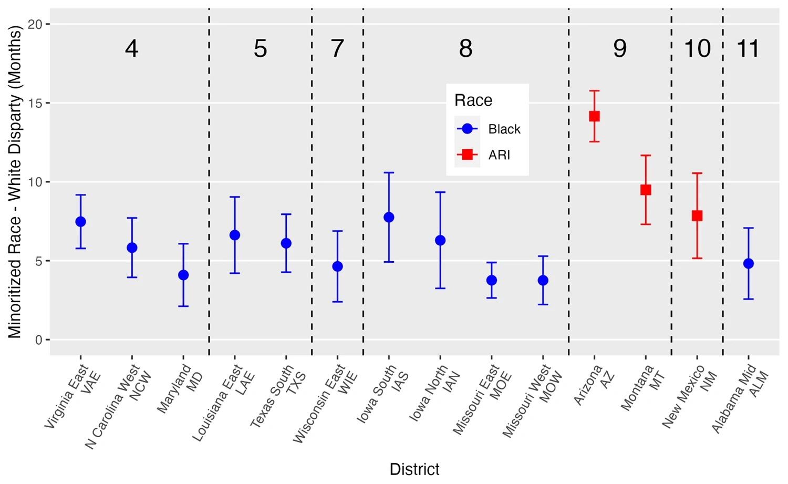

Federal District Courts and Race-Based Criminal Sentencing Disparities
================
Laurie Baker, Helen Grundman, Lily Khadjavi, Saeja Kim, Momin Malik,
Ariana Mendible, Omayra Ortega, José Pabón, Chad M. Topaz, Thomas
Wakefield

December 18, 2023

- [1 Acknowledgments](#1-acknowledgments)
- [2 Introduction](#2-introduction)
- [3 Background](#3-background)
  - [3.1 Motivation](#31-motivation)
  - [3.2 The U.S. federal court system](#32-the-us-federal-court-system)
  - [3.3 How federal sentencing works](#33-how-federal-sentencing-works)
  - [3.4 Introduction to the data](#34-introduction-to-the-data)
    - [3.4.1 Explanation of variables](#341-explanation-of-variables)
- [4 Exploratory Data Analysis](#4-exploratory-data-analysis)
  - [4.1 Reading in the data](#41-reading-in-the-data)
  - [4.2 Data structure and contents](#42-data-structure-and-contents)
  - [4.3 Types of variables](#43-types-of-variables)
  - [4.4 How to visualize
    relationships](#44-how-to-visualize-relationships)
    - [4.4.1 Two numerical variables](#441-two-numerical-variables)
    - [4.4.2 One numerical and one categorical
      variable](#442-one-numerical-and-one-categorical-variable)
    - [4.4.3 Two categorical variables](#443-two-categorical-variables)
    - [4.4.4 Who?](#444-who)
    - [4.4.5 What?](#445-what)
    - [4.4.6 When?](#446-when)
    - [4.4.7 Where?](#where)
- [5 Regression Analysis](#5-regression-analysis)
  - [5.1 Fitting a line: The basics](#51-fitting-a-line-the-basics)
    - [5.1.1 Analytically fit a line to two
      points](#511-analytically-fit-a-line-to-two-points)
    - [5.1.2 Numerically fit a line to two
      points](#512-numerically-fit-a-line-to-two-points)
    - [5.1.3 Analytically fit a line to three
      points](#513-analytically-fit-a-line-to-three-points)
    - [5.1.4 Numerically fit a line to three
      points](#514-numerically-fit-a-line-to-three-points)
  - [5.2 Introduction to linear
    regression](#52-introduction-to-linear-regression)
    - [5.2.1 Summarizing a linear regression
      model](#521-summarizing-a-linear-regression-model)
    - [5.2.2 Linear regression with a categorical
      predictor](#522-linear-regression-with-a-categorical-predictor)
    - [5.2.3 Multiple linear
      regression](#523-multiple-linear-regression)
  - [5.3 Linear Regression with the Federal Criminal Sentencing
    Data](#53-linear-regression-with-the-federal-criminal-sentencing-data)
    - [5.3.1 Baseline model](#531-baseline-model)
    - [5.3.2 Replicating Model 11, District Model
      II](#532-replicating-model-11-district-model-ii)
- [6 Additional Results](#6-additional-results)

------------------------------------------------------------------------

This work is governed under the [Creative Commons
Attribution-NonCommercial-ShareAlike 4.0 International
license](https://creativecommons.org/licenses/by-nc-sa/4.0/).

Citation: Laurie Baker, Helen Grundman, Lily Khadjavi, Saeja Kim, Momin
Malik, Ariana Mendible, Omayra Ortega, José Pabón, Chad M. Topaz, Thomas
Wakefield, and Institute for the Quantitative Study of Inclusion,
Diversity, and Equity (QSIDE), 2023.

------------------------------------------------------------------------

# 1 Acknowledgments

This project started at the Institute for Computational and Experimental
Research on Mathematics (ICERM) as part of the week-long workshop
“Educating at the Intersection of Data Science and Social Justice,”
organized by Ron Buckmire, Drew Lewis, Omayra Ortega, Katharine Ott, and
Matt Salamone. This workshop was part of a summer program on “Data
Science and Social Justice: Networks, Policy, and Education,” organized
by Carrie Diaz Eaton, Joseph Hibdon, Drew Lewis, Jessica Libertini,
Omayra Ortega, Victor Piercey, Björn Sandstede, Talitha Washington, Tian
An Wong, and Heather Zinn Brooks.

# 2 Introduction

Welcome to a case study within the Data4Justice curriculum developed by
the [Institute for the Quantitative Study of Inclusion, Diversity, and
Equity (QSIDE)](http://www.qsideinstitute.org). This case study is
designed to help you learn data science skills in a social justice
context. At QSIDE, we hope that our curriculum will be used by anyone
and everyone who is interested in helping to right wrongs by using
quantitative tools. This case study should be accessible to advanced
high school students, to undergraduate students, and to more experienced
academics in any field who would like to learn new skills and ideas.
QSIDE also envisions our case study being used by individuals working in
industry, government, and the nonprofit sphere, as well as any hobbyists
and other members of the general public wanting to challenge themselves.
In short, if you are interested and positioned to learn more about the
interface of social justice and data science, this case study is for
you.

If you are a high school teacher, a college or university faculty
member, or serve in any other instructional capacity, consider using
this case study in ways that are appropriate for your audience. Less
experienced audiences might require a step-by-step approach, proceeding
through the case study in a linear manner at a pace that is not rushed.
More experienced audiences could benefit from using the beginning parts
of the case study, and then being challenged to do more open-ended
exploration. The case study could also be used as the basis for a data
hackathon event.

If you are new to data science in R/Rstudio, before you embark on this
case study, we strongly recommend working through the case study on
[Diversity of Artists in Major U.S.
Museums](https://htmlpreview.github.io/?https://github.com/qsideinstitute/Data4Justice-Curriculum/blob/main/Data4Justice-Curriculum-v4.html),
which will provide some familiarity with R fundamentals and with
exploratory data analysis. This current case study can be viewed as a
tool to cement and expand upon the concepts shared in the previous
Diversity of Artists in Major U.S. Museums case study.

This case study assumes that you have access to RStudio, a programming
environment built on the statistical computing language R. If you want
to use RStudio on your own computer, you should first [install
R](https://cran.r-project.org), and then [install
RStudio](https://www.rstudio.com/products/rstudio/download/#download).
Alternatively, you can register for a free account with [Posit
Cloud](https://posit.cloud), an online version of RStudio that you can
access through any standard web browser.

R is a powerful language, made even more powerful by additional free
software packages that enhance its functionality. Regardless of how you
run RStudio, you will need access to the packages below, which are
automatically activated in the code that produces this document. Make
sure you download these packages using the `Packages` tab in RStudio and
run the commands below before proceeding with this case study.

``` r
library(tidyverse)
library(ggridges)
library(tidycensus)
library(palmerpenguins)
library(gridExtra)
library(broom)
library(emmeans)
library(kableExtra)
```

QSIDE is a 501(c)3 tax-exempt nonprofit organization. Initiatives like
our Data4Justice curriculum require resources to produce, and we depend
on a public that is willing to support social justice initiatives.
Anyone is welcome to use this document for free, but we ask those who
are able to [please make a donation to
QSIDE](https://qsideinstitute.org/support-us/donate/) so that we can
maintain our innovative research, action, and education efforts at the
interface of data science and social justice. Additionally, we ask
anyone using any or all of this document to cite it properly using the
citation above.

Now let’s get to learning!

# 3 Background

Our case study centers around issues of racial disparity in criminal
sentencing, and is based on research performed by one of this case
study’s authors. Before proceeding, take some time to read the original
study, [Federal Criminal Sentencing: Race-Based Disparate Impact and
Differential Treatment in Judicial
Districts](https://www.nature.com/articles/s41599-023-01879-5). There
may be some things in the paper that you don’t understand — perhaps just
a few, or perhaps many. That’s ok. The goal of reading the paper is not
to understand every detail, but rather to provide a first exposure to
the material you’ll be working on and to get you excited about it. For
convenience, here is the abstract.

------------------------------------------------------------------------

> **Abstract**
>
> Race-based inequity in federal criminal sentencing is widely
> acknowledged, and yet our understanding of it is far from complete.
> Inequity may arise from several sources, including direct bias of
> courtroom actors and structural bias that produces racially disparate
> impacts. Irrespective of these sources, inequity may also originate
> from different loci within the federal system. We bring together the
> questions of the sources and loci of inequity. The purpose of our
> study is to quantify race-based disparate impact and differential
> treatment at the national level and at the level of individual federal
> judicial districts. We analyze over one-half million sentencing
> records publicly available from the United States Sentencing
> Commission database, spanning the years 2006 to 2020. At the
> system-wide level, Black and Hispanic defendants receive average
> sentences that are approximately 19 months longer and 5 months longer,
> respectively. Demographic factors and sentencing guideline elements
> account for nearly 17 of the 19 months for Black defendants and all
> five of the months for Hispanic defendants, demonstrating the
> disparate impact of the system at the national level. At the
> individual district level, even after controlling for each district’s
> unique demographics and implementation of sentencing factors, 14
> districts show significant differences for minoritized defendants as
> compared to white ones. These unexplained differences are evidence of
> possible differential treatment by judges, prosecutors, and defense
> attorneys.

------------------------------------------------------------------------

In this case study, we won’t cover all of the results described in this
paper, but we will cover some of the most important ones. Thinking about
the distinction between observational and experimental case studies,
this case study can be viewed as an observational study because the
researchers are attempting to learn about the population of interest by
sampling and observing patterns without manipulating any variables.

## 3.1 Motivation

What are race-based sentencing disparities, and why should we care?
Race-based sentencing disparities in the United States refer to the
marked and consistent differences in the severity and types of sentences
given to individuals of different racial and ethnic backgrounds,
convicted of the same or similar crimes. This disparity has been a
subject of debate and research for many decades, as part of a broader
discourse on racial bias in the criminal justice system. It has been
consistently found that people of color are more likely to receive
harsher sentences than their white counterparts.

This phenomenon can be traced back to the historical context of the
United States. Racial discrimination and bias have been entrenched in
American society, and the criminal justice system is not immune to these
systemic biases. The War on Drugs in the 1980s and 1990s, for example,
disproportionately impacted communities of color, with crack cocaine
offenses (more common among Black communities) punished far more
severely than powder cocaine offenses (more common among white
communities). This is despite the fact that both substances are
pharmacologically identical.

While legal changes have reduced some explicit forms of discrimination,
research suggests that implicit bias and structural factors continue to
contribute to sentencing disparities. For example, mandatory minimum
sentencing laws can disproportionately impact people of color due to
disparities in the types of crimes committed and the socioeconomic
conditions that can lead to criminal behavior.

From a social justice perspective, race-based sentencing disparities
matter significantly. They reflect and perpetuate racial inequity,
undermining the promise of equal treatment under the law that is a
fundamental principle of democratic societies. They erode public trust
in the legal system, making it more difficult for law enforcement and
the courts to function effectively.

Furthermore, these disparities contribute to the vicious cycle of
systemic racism. Individuals who receive harsher sentences are more
likely to face significant challenges in reintegrating into society
post-incarceration, including limited employment opportunities,
disruptions to family structures, and disenfranchisement. These
challenges can increase the likelihood of recidivism, perpetuating
racial disparities in economic and social outcomes.

The existence of race-based sentencing disparities is a call to action
for policy reform. This may include efforts to reduce mandatory minimum
sentences, increase the use of alternatives to incarceration, provide
bias training for judges and prosecutors, and implement more
transparent, objective sentencing guidelines. Addressing these
disparities is a crucial step toward realizing a more equitable and just
society.

In conclusion, race-based sentencing disparities in the U.S. not only
reflect the systemic racism embedded within the criminal justice system
but also exacerbate social and economic inequalities. Achieving social
justice necessitates a comprehensive and diligent effort to rectify
these disparities, creating a fair, unbiased system that upholds the
tenet of equal treatment for all, regardless of race or ethnicity.
Fixing our biased system can be aided by identifying the loci of racial
inequity, which is the purpose of this case study.

## 3.2 The U.S. federal court system

Before we dive into understanding race-based sentencing disparities in
the United States, let’s understand some important context about the
U.S. federal court system and federal sentencing. The United States
federal court system is, at its core, a three-tiered structure, starting
with district courts at the bottom, circuit courts in the middle, and
the Supreme Court at the top.

The district courts are the workhorses of the federal judiciary,
handling the vast majority of federal cases. There are 94 federal
judicial districts, including one or more districts in each state, as
well as courts for the District of Columbia and Puerto Rico. Three
territories of the United States – the Virgin Islands, Guam, and the
Northern Mariana Islands – have district courts as well.

Above the district courts are the United States courts of appeals. These
courts are divided into 12 regional circuits across America, each of
which hears appeals from the district courts located within its circuit.
There’s also the Court of Appeals for the Federal Circuit, which has
nationwide jurisdiction to hear appeals in specialized cases, such as
those involving patent laws and cases decided by the U.S. Court of
International Trade and the U.S. Court of Federal Claims.

At the pinnacle of the federal court system is the Supreme Court of the
United States, composed of nine justices. The Supreme Court mainly hears
appeals from the circuit courts and state supreme courts, but it also
has original jurisdiction over a small range of cases.

Federal judges, including Supreme Court justices, are nominated by the
President and confirmed by the Senate. They serve “during good
behavior,” which effectively means they can hold their positions for
life. A federal judge may also exit office through voluntary retirement
or resignation.

However, judges can be removed from office before their term ends if
they’re impeached and convicted. Impeachment is a political process,
initiated by the House of Representatives and decided by the Senate.
Impeachment of federal judges has happened 15 times in U.S. history, and
of these, eight judges have been convicted and removed from office.

As of 2021, there were about 677 federal district court judgeships.
These judges deal with a broad range of cases, including those related
to federal laws, disputes between states, and issues involving the
federal government.

## 3.3 How federal sentencing works

In this module, we are considering sentencing patterns, and possible
bias, in criminal cases adjudicated in the federal district courts from
2006–2020. You might wonder what sorts of cases end up in these courts.
The cases are restricted to those that involve federal statutes,
interpretations of the US Constitution, or more than one state.

In criminal cases resulting in a conviction, the crime statute itself
may have sentencing restrictions, but beyond those, a judge has complete
freedom in setting the length of the prison term. We will examine data
at the national level as well as within individual districts, with an
eye for detecting possible racial bias.

In 1987, the United States Sentencing Commission created sentencing
guidelines for Federal Courts. These guidelines prescribe a range of
possible prison terms, taking into account both the severity of the
crime and the prior criminal history of the defendant, as well as
numerous possible mitigating factors (ones that may call for shortening
the sentence) and aggravating factors (ones that may call for
lengthening the sentence). Although these guidelines were initially
mandatory, a 2005 Supreme Court ruling changed them to being only
advisory, returning great freedom in sentencing to each individual
judge.

## 3.4 Introduction to the data

We will analyze the over one-half million sentencing records spanning
the years 2006 to 2020 provided by the U.S. Sentencing Commission.
Publicly available data is usually quite messy, with many missing and
ambiguous entries. For this reason, you will be using a curated copy,
that is, one that has been “cleaned up” (directions for obtaining the
curated copy is in the following section of this module). The sentence
lengths we are using are given in months and do not include probation
nor alternative confinement. Since our aim is to compare lengths of
prison sentences imposed, we have eliminated from the data set any cases
involving non-citizens–those sentences frequently involve deportation,
which is not comparable to prison terms. We combined the information
from some variables (creating new variables) and eliminated incomplete
data items, that is entire records, for defendants for whom we are not
given sufficient information. We have eliminated the (relatively few)
records with sentence lengths of more than 470 months, but retained
those with life sentences, which have been coded by the Commission as
470 months. Finally, because there are very few defendants sentenced in
the district court of the Northern Mariana Islands, those items were
also eliminated.

The data come from two sources: the pre-sentencing report and the
Statement of Reasons. The pre-sentencing report is prepared by the
District’s Probation Office and based on a post-trial, pre-sentencing
investigation including an interview with the defendant. A draft of this
report is issued to the attorneys for comments and corrections and a
final version is given to the attorneys and judge. The Statement of
Reasons is a form filled out by the judge explaining/supporting the
sentence imposed.

### 3.4.1 Explanation of variables

The two main variables used in the non-mandatory guidelines for
sentencing are criminal history (`criminal_history`) and an indicator of
the severity of the crime (`all_adjustments`). The two variables are
combined, using a table, to determine the recommended range of the
sentence.

The variable `criminal_history` is coded as a value 1 to 6. Prior
convictions are assigned points depending on the number of prior
convictions, length(s) of sentence(s), and whether or not past crimes
involved violence. The points are then summed and translated into a
criminal history category represented by the `criminal_history` values 1
through 6. A value of 1, for example, would refer to a defendant with at
most one conviction, where that conviction resulted in a sentence of
less than 60 days. As an additional example, a defendant who has three
prior convictions with sentences of over 13 months and two with
sentences between 2 and 13 months would be assigned a total of 13
points, yielding the criminal history category 6. With only one prior
conviction of each type, the category would be 3. The calculation is not
quite this simple, with many adjustments and some types of convictions
and very old convictions being ignored.

The variable `all_adjustments` is a rating of the *offense level* (how
severe the crime is) with *adjustments* (added considerations that call
for higher or lower offense level), as defined by the US Sentencing
Commission’s Sentencing Guidelines Manual and interpreted by the US
Probation Office and/or the Presiding Judge. There are 43 levels where,
for example, first degree murder has a base level (that is, level prior
to adjustments) of 43 and trespassing has a base level of 4. Two
additional variables, `base_chapter2_adjustments` and
`base_chapter2_3_adjustments`, have to do with the derivation of
`all_adjustments`, but you can ignore these variables for the purposes
of this case study.

Apart from `criminal_history` and `all_adjustments`, there are several
variables related to the identity of defendants:

- `age`, which refers to a defendant’s age in years.
- `sex`, which has been coded as a binary variable 0 and 1, where 0 is
  “Male” and 1 is “Female”.
- `educ`, which refers to a defendant’s educational attainment which
  consists of 4 levels (1 refers to a defendant having less than high
  school graduation, 3 refers to a high school graduate, 5 means having
  some college, and 6 means college graduate), and
- `race`, which refers to a defendant’s race and has levels “black”,
  “hispanic”, “white” and “other”.

A key motivation for this work is exploring how our personal and racial
identities influence the judicial sentencing. In a fair, democratic
system this identity or perceived identity should not affect how we are
treated by the justice system. It is important to note that these
characteristics are not independent of one another but can intersect and
interact with one another. This combined effect is known as
intersectionality. The Center for Intersectional Justice describes the
concept of intersectionality as: “the ways in which systems of
inequality based on gender, race, ethnicity, sexual orientation, gender
identity, disability, class and other forms of discrimination
‘intersect’ to create unique dynamics and effects” (Ref: [Center for
Intersectional
Justice](https://www.intersectionaljustice.org/what-is-intersectionality),
July 20, 2023).

Let’s take a moment to also consider how these identity-based variables
were defined. Sex, for example, is defined in a pre-sentencing report
that comes out of the investigation done by the probation office. This
goes to the attorneys and also comes out of an interview with the
individual. It should be noted that there are only two categories, so it
is likely that there might be only two options possible for the
individual. Not only is this challenging in that it restricts a
defendant’s identity to two rigid categories, but a binary variable will
not reflect sentenced individuals’ gender identity and excludes several
groups, such as non-binary individuals, altogether. Therefore, a
limitation of this study comes through in the “levels” of each variable
being predetermined by the data-collecting institutions we are relying
on. It is critical that in such instances we not only acknowledge this
limitation, but contextualize our analysis and inferences with this
knowledge.

<!-- Attempted to write this section above, but could clarify/add based on these notes:
- See Background section or link to official report for more information
- Discuss how a binary variable will not reflect sentenced individuals gender identity and excludes several groups. It is also limiting in nature.
- Discuss difference between sex and gender
- Discuss who has defined this variable and why this is problematic
- Discuss the limitations and how this affects the analysis and inferences we can make.
- Update sex label with more appropriate label based on Background research. 
&#10;Also to possibly add: explaining why we are going to use "ARI" rather than "other" for the race category -->

The nine other variables in the data set refer to information about the
court cases themselves:

- `year`, which describes the year in which the court case took place,
- `sentence_length`, the length prescribed to a defendant in months,
- `guilty_plea`, where 0 means the defendant did not plead guilty and 1
  means the defendant did plead guilty, <!-- check this! -->
- `grid_cell`, which is a term that represents the interaction between
  `criminal_history` and `all_adjustments`,
- `mandatory_min`, which signifies whether or not the court case
  included a mandatory minimum sentence,
- `gov_departures`, which tracks government sponsored downward
  departures, and
- `district`, which refers to the district where the trial took place.

As you work through the analyses in this case study, you might return to
this background information as needed to remind yourself of the context
of the data.

# 4 Exploratory Data Analysis

Alright, let’s start digging into the data! Whenever you are handed a
new data set, you want to read in the data so you can view it in RStudio
and perform an Exploratory Data Analysis (EDA).

## 4.1 Reading in the data

You can read in your data using `read_csv()` and create a variable named
`us_sent` that refers to the dataset.

``` r
us_sent <- read_csv("data/cleaned_data_renamed.csv")
```

To view the data in a new tab within RStudio, you can use the `View()`
function. Because this is an interactive RStudio function that doesn’t
work when we knit the document, we have set up our document so that the
code can be viewed below but not actually run when we knit
(specifically, we used the code chunk option `eval = FALSE`).

``` r
View(us_sent)
```

## 4.2 Data structure and contents

As you may remember, in a tidy data set, each row is an observation,
each column is a variable, and each cell is a value. In the case of the
federal criminal sentencing data, each row represents an individual who
was sentenced in the federal district court system in the U.S. in one of
the country’s 94 districts.

When we start exploring a data set, we will want to think about some key
questions using the four W’s: who, what, when, and where. Specifically,
you might ask in the context of this study: who is in our data set? What
was the sentence? When was the individual was sentenced? Where did the
sentence occur?

Can you guess which variables pertain to each question? Let’s inspect
our variables, which are in the columns, and see if that helps. There
are several functions we can use to do this:

- `names()` will provide the names of the columns in the data set

  ``` r
  names(us_sent)
  ```

      ##  [1] "sentence_length"             "age"                        
      ##  [3] "sex"                         "educ"                       
      ##  [5] "year"                        "guilty_plea"                
      ##  [7] "base_chapter2_adjustments"   "base_chapter2_3_adjustments"
      ##  [9] "all_adjustments"             "grid_cell"                  
      ## [11] "mandatory_min"               "gov_departures"             
      ## [13] "district"                    "race"                       
      ## [15] "criminal_history"

- `summary()` will provide the names of the columns in the data set
  along with a brief numeric or qualitative summary of each variable

  ``` r
  summary(us_sent)
  ```

      ##  sentence_length       age             sex              educ      
      ##  Min.   :  0.00   Min.   :16.00   Min.   :0.0000   Min.   :1.000  
      ##  1st Qu.: 12.03   1st Qu.:28.00   1st Qu.:0.0000   1st Qu.:1.000  
      ##  Median : 41.00   Median :35.00   Median :0.0000   Median :3.000  
      ##  Mean   : 62.96   Mean   :36.96   Mean   :0.1681   Mean   :3.101  
      ##  3rd Qu.: 87.00   3rd Qu.:44.00   3rd Qu.:0.0000   3rd Qu.:5.000  
      ##  Max.   :470.00   Max.   :97.00   Max.   :1.0000   Max.   :6.000  
      ##       year       guilty_plea     base_chapter2_adjustments
      ##  Min.   :2006   Min.   :0.0000   Min.   :-8.00            
      ##  1st Qu.:2009   1st Qu.:0.0000   1st Qu.:16.00            
      ##  Median :2013   Median :0.0000   Median :24.00            
      ##  Mean   :2013   Mean   :0.0454   Mean   :23.21            
      ##  3rd Qu.:2017   3rd Qu.:0.0000   3rd Qu.:30.00            
      ##  Max.   :2020   Max.   :1.0000   Max.   :53.00            
      ##  base_chapter2_3_adjustments all_adjustments  grid_cell         mandatory_min  
      ##  Min.   : 1.00               Min.   : 1.00   Length:518719      Mode :logical  
      ##  1st Qu.:16.00               1st Qu.:14.00   Class :character   FALSE:453517   
      ##  Median :24.00               Median :21.00   Mode  :character   TRUE :65202    
      ##  Mean   :23.52               Mean   :21.31                                     
      ##  3rd Qu.:30.00               3rd Qu.:28.00                                     
      ##  Max.   :64.00               Max.   :43.00                                     
      ##  gov_departures    district             race           criminal_history
      ##  Mode :logical   Length:518719      Length:518719      Min.   :1.000   
      ##  FALSE:417903    Class :character   Class :character   1st Qu.:1.000   
      ##  TRUE :100816    Mode  :character   Mode  :character   Median :2.000   
      ##                                                        Mean   :2.655   
      ##                                                        3rd Qu.:4.000   
      ##                                                        Max.   :6.000

- `str()` will display (sometimes complex) details of the internal
  structure of the R object, including the table dimensions, variable
  names, variable types, and the first 10 observations for each variable
  within a data table

  ``` r
  str(us_sent)
  ```

      ## spc_tbl_ [518,719 × 15] (S3: spec_tbl_df/tbl_df/tbl/data.frame)
      ##  $ sentence_length            : num [1:518719] 0.46 90 65 87 60 62 84 120 53 0 ...
      ##  $ age                        : num [1:518719] 36 21 35 26 30 23 29 26 45 36 ...
      ##  $ sex                        : num [1:518719] 0 0 0 0 0 0 0 0 0 1 ...
      ##  $ educ                       : num [1:518719] 3 3 1 1 3 5 1 3 3 3 ...
      ##  $ year                       : num [1:518719] 2006 2006 2006 2006 2006 ...
      ##  $ guilty_plea                : num [1:518719] 0 0 0 0 0 0 0 0 0 0 ...
      ##  $ base_chapter2_adjustments  : num [1:518719] 38 18 28 32 28 28 28 14 20 20 ...
      ##  $ base_chapter2_3_adjustments: num [1:518719] 38 18 28 32 28 28 26 14 20 20 ...
      ##  $ all_adjustments            : num [1:518719] 35 15 25 29 26 25 23 34 17 17 ...
      ##  $ grid_cell                  : chr [1:518719] "XFOLSOR35XCRHISSR5" "XFOLSOR15XCRHISSR4" "XFOLSOR25XCRHISSR2" "XFOLSOR29XCRHISSR3" ...
      ##  $ mandatory_min              : logi [1:518719] FALSE TRUE FALSE FALSE FALSE TRUE ...
      ##  $ gov_departures             : logi [1:518719] TRUE FALSE FALSE FALSE FALSE FALSE ...
      ##  $ district                   : chr [1:518719] "Dist of Columbia" "Dist of Columbia" "Dist of Columbia" "Dist of Columbia" ...
      ##  $ race                       : chr [1:518719] "white" "black" "black" "black" ...
      ##  $ criminal_history           : num [1:518719] 5 4 2 3 5 1 5 6 4 1 ...
      ##  - attr(*, "spec")=
      ##   .. cols(
      ##   ..   sentence_length = col_double(),
      ##   ..   age = col_double(),
      ##   ..   sex = col_double(),
      ##   ..   educ = col_double(),
      ##   ..   year = col_double(),
      ##   ..   guilty_plea = col_double(),
      ##   ..   base_chapter2_adjustments = col_double(),
      ##   ..   base_chapter2_3_adjustments = col_double(),
      ##   ..   all_adjustments = col_double(),
      ##   ..   grid_cell = col_character(),
      ##   ..   mandatory_min = col_logical(),
      ##   ..   gov_departures = col_logical(),
      ##   ..   district = col_character(),
      ##   ..   race = col_character(),
      ##   ..   criminal_history = col_double()
      ##   .. )
      ##  - attr(*, "problems")=<externalptr>

- `glimpse()` is a simplified version of `str()` that only displays the
  dimensions, variable names, variable types, and the first set of
  observations for each variable within a data table (how many
  observations depends on the width of your output)

  ``` r
  glimpse(us_sent)
  ```

      ## Rows: 518,719
      ## Columns: 15
      ## $ sentence_length             <dbl> 0.46, 90.00, 65.00, 87.00, 60.00, 62.00, 8…
      ## $ age                         <dbl> 36, 21, 35, 26, 30, 23, 29, 26, 45, 36, 44…
      ## $ sex                         <dbl> 0, 0, 0, 0, 0, 0, 0, 0, 0, 1, 0, 0, 0, 0, …
      ## $ educ                        <dbl> 3, 3, 1, 1, 3, 5, 1, 3, 3, 3, 3, 5, 1, 3, …
      ## $ year                        <dbl> 2006, 2006, 2006, 2006, 2006, 2006, 2006, …
      ## $ guilty_plea                 <dbl> 0, 0, 0, 0, 0, 0, 0, 0, 0, 0, 0, 0, 0, 0, …
      ## $ base_chapter2_adjustments   <dbl> 38, 18, 28, 32, 28, 28, 28, 14, 20, 20, 30…
      ## $ base_chapter2_3_adjustments <dbl> 38, 18, 28, 32, 28, 28, 26, 14, 20, 20, 30…
      ## $ all_adjustments             <dbl> 35, 15, 25, 29, 26, 25, 23, 34, 17, 17, 27…
      ## $ grid_cell                   <chr> "XFOLSOR35XCRHISSR5", "XFOLSOR15XCRHISSR4"…
      ## $ mandatory_min               <lgl> FALSE, TRUE, FALSE, FALSE, FALSE, TRUE, FA…
      ## $ gov_departures              <lgl> TRUE, FALSE, FALSE, FALSE, FALSE, FALSE, F…
      ## $ district                    <chr> "Dist of Columbia", "Dist of Columbia", "D…
      ## $ race                        <chr> "white", "black", "black", "black", "black…
      ## $ criminal_history            <dbl> 5, 4, 2, 3, 5, 1, 5, 6, 4, 1, 1, 1, 2, 1, …

> Note: You can use the built in R help documentation to learn more
> about each function by typing a question mark followed by the name of
> the function in the console, e.g. `?str()`

## 4.3 Types of variables

What is halfway between 0 and 1? It is 1/2. What is halfway between
horse and dog? There is no such thing! Thinking about each type of data
is very important so that we don’t code silly things like the mean of
animal species.

There are two main types of data: **categorical data** and **numerical
data**. Some examples of categorical data would be color, ethnicity,
employment status, or states/countries. These have unique values, like
California or Oregon. In other words, categorical variables take on
discrete, finite values. In R, these variables might show up as
characters (`chr`), `TRUE` or `FALSE` statements which are called
logical vectors (`lgl`), coded as the integers (`int`), or factors
(`fct`).

On the other hand, numerical data is in number form. Some examples of
numerical data are temperature, height, and salary. It makes perfect
sense to be 165.8 cm tall or for the temperature to be 82.4 degrees
outside. In R, these variables might show up as doubles (`dbl`) or
integers (`int`).

There are some confusing data types that use numbers to *represent*
categorical data, like zip code. You may live in the zip code 90201,
which is a number, but you can’t live in the zip code 90210.3. Only
whole numbers, and specific ones at that, make sense here. We will learn
more about using numbers to represent categorical data in this lesson.

Finally, dates and times are special variables that are treated
differently depending on the context and structure of the values. In
some cases, especially when there are few discrete values, dates and
times might be treated as categorical variables. In some formats and in
other cases, dates and times might be treated as numerical variables
(note: even though a date or time might be represented as a number, this
is not the type of numerical variable where it makes sense to do math in
the typical way!). When data are specific dates (with day, month, and
year) and/or times (with hours, minutes, seconds), then R has special
data types that capture dates and times along a continuum. We don’t need
to worry about that for this case study, though!

**Can you identify which data type each variable in the federal criminal
sentencing data is?**

You may notice that some variables’ data types are not what you would
expect. Oftentimes, R will automatically assign data types to variables
in ways you don’t want.

Let’s take the variable `sex`, for example. Remember that `sex` has been
coded as a binary variable 0 and 1, where 0 is “Male” and 1 is “Female”.
We can confirm this using `distinct()`, a function that displays all
unique values under a specified column.

``` r
us_sent %>%
  distinct(sex)
```

    ## # A tibble: 2 × 1
    ##     sex
    ##   <dbl>
    ## 1     0
    ## 2     1

We can also see that `sex` is currently classified as a `dbl` above.
Let’s change that to the `fct` data type so R recognizes the variable as
categorical. To deal with this, we can change the data types of
variables using two important functions: `mutate()` and `factor()`.

You can think of `mutate()` as being a function that essentially
replaces the a column in the data set with a new one. In this case, we
are replacing the `sex` variable column that is coded as `dbl` with a
new column for `sex` coded as `fct`. We can use the function `factor()`
to specify the two levels of `sex`, 0 and 1, and labeling each level as
“Male” and “Female” respectively. Using this process, we are telling R
to consider `sex` to be a categorical variable with two levels.

``` r
us_sent <- us_sent %>% 
  mutate(sex = factor(sex, levels = c(0, 1), labels = c("Male", "Female")))
```

Let’s check our work by using `glimpse()` again:

``` r
glimpse(us_sent)
```

    ## Rows: 518,719
    ## Columns: 15
    ## $ sentence_length             <dbl> 0.46, 90.00, 65.00, 87.00, 60.00, 62.00, 8…
    ## $ age                         <dbl> 36, 21, 35, 26, 30, 23, 29, 26, 45, 36, 44…
    ## $ sex                         <fct> Male, Male, Male, Male, Male, Male, Male, …
    ## $ educ                        <dbl> 3, 3, 1, 1, 3, 5, 1, 3, 3, 3, 3, 5, 1, 3, …
    ## $ year                        <dbl> 2006, 2006, 2006, 2006, 2006, 2006, 2006, …
    ## $ guilty_plea                 <dbl> 0, 0, 0, 0, 0, 0, 0, 0, 0, 0, 0, 0, 0, 0, …
    ## $ base_chapter2_adjustments   <dbl> 38, 18, 28, 32, 28, 28, 28, 14, 20, 20, 30…
    ## $ base_chapter2_3_adjustments <dbl> 38, 18, 28, 32, 28, 28, 26, 14, 20, 20, 30…
    ## $ all_adjustments             <dbl> 35, 15, 25, 29, 26, 25, 23, 34, 17, 17, 27…
    ## $ grid_cell                   <chr> "XFOLSOR35XCRHISSR5", "XFOLSOR15XCRHISSR4"…
    ## $ mandatory_min               <lgl> FALSE, TRUE, FALSE, FALSE, FALSE, TRUE, FA…
    ## $ gov_departures              <lgl> TRUE, FALSE, FALSE, FALSE, FALSE, FALSE, F…
    ## $ district                    <chr> "Dist of Columbia", "Dist of Columbia", "D…
    ## $ race                        <chr> "white", "black", "black", "black", "black…
    ## $ criminal_history            <dbl> 5, 4, 2, 3, 5, 1, 5, 6, 4, 1, 1, 1, 2, 1, …

Great! It worked. `sex` is now of the `fct` data type. Now we can use
this process to change the rest of the variables with incorrect data
types. You can see that we don’t always need to add labels, we just do
that when we think it might be useful. Also notice we are treating
`year` as a categorical variable for our analyses.

``` r
us_sent <- us_sent %>% 
  mutate(educ = factor(educ, levels = c(1, 3, 5, 6),
                       labels = c("Less than HS", 
                                  "HS Grad", 
                                  "Some College", 
                                  "College Grad")),
         year = factor(year),
         criminal_history = factor(criminal_history),
         guilty_plea = factor(guilty_plea))
```

Now that our variable data types are sorted out, let’s change one final
component of our data set. Let’s capitalize each category of the `race`
variable using `str_to_title()`. Then we can use `fct_recode()` to turn
`race` into a factor while also changing the “Other” level to “ARI”,
which stands for “another racial identity”, to clarify what we mean.

``` r
us_sent <- us_sent %>% 
  mutate(race =  str_to_title(race),
         race = fct_recode(race, "ARI" = "Other"))
```

You can use `View(us_sent)` again to take a look at all the alterations
we made to the dataset.

Now that we have our data types sorted out, we can start exploring the
data!

## 4.4 How to visualize relationships

A good practice to do with a new data set is to explore it through
visualization. We can get a sense of the individual distributions of
each variable (you might refer back to the case study on [Diversity of
Artists in Major U.S.
Museums](https://htmlpreview.github.io/?https://github.com/qsideinstitute/Data4Justice-Curriculum/blob/main/Data4Justice-Curriculum-v4.html)
for an introduction to graphs of a single variable) and then move on to
look at the relationships among two or more variables. As with
single-variable graphs, the type of graph we use will depend on the
types of variables we are exploring. We will walk through a few simple
graphs below that allow us to look at relationships between variables.

### 4.4.1 Two numerical variables

A *scatterplot* is typically used to visualize the relationship between
two numerical variables. One variable, usually the *dependent* variable,
goes on the $y$ axis, and the other variable goes on the $x$ axis, and
each observation in the data is represented by a point on the graph.

We will use a scatterplot to display how a defendant’s age relates to
their sentence length. Recall, to use `ggplot()` from the **ggplot2**
package, we start by indicating the data set we want to plot: `us_sent`.
Then, we specify what our variables of interest are—in this case, we are
interested in `age` and `sentence_length`. The command `geom_point()`
specifies that we want to use a scatterplot to represent our data.

There are many fun and useful modifications that change the way a
scatterplot looks. For example, you can change the color of data points
using `color`, you can change the size of data points using `size`, and
you can specify the transparency of data points using `alpha` on scale
of 0 = *fully transparent* to 1 = *fully opaque*. It’s also good
practice to come up with a useful title and good axis labels using the
`labs()` command.

``` r
ggplot(us_sent, aes(x = age, y = sentence_length)) + 
  geom_point(color = "coral2",
             size = 0.5,
             alpha = 0.7) +
  labs(title = "Sentence Length by Age",
       x = "Age (Years)",
       y = "Sentence Length (Months)")
```

<!-- -->

What do you notice in this scatterplot? What do you wonder?

### 4.4.2 One numerical and one categorical variable

We just created a scatterplot with two numerical variables. Now we will
see what happens if one variable is numerical and the other is
categorical. Run the code below that plots `criminal_history` (a
categorical variable) against `age` (a numerical variable).

``` r
ggplot(us_sent, aes(x = criminal_history, y = age)) + 
  geom_point(color = "coral2", 
             alpha = 0.7) +
  labs(title = "Age by Criminal History Level",
       x = "Criminal History Level",
       y = "Age (Years)")
```

<!-- -->

You might think it’s a little difficult to see any clear patterns when
using a scatterplot to examine one quantitative and one categorical
variable because the points are so densely packed together. That’s why a
scatterplot is generally *not* an appropriate graph to use in this
situation. Instead, a more appropriate plot for this combination of
variables is the side-by-side boxplot. You can create a side-by-side
boxplot by simply switching out `geom_point()` with `geom_boxplot()` in
the code above:

``` r
ggplot(us_sent, aes(x = criminal_history, y = age)) + 
  geom_boxplot(color = "coral2", 
               alpha = 0.7) +
  labs(title = "Age by Criminal History Level",
       x = "Criminal History Level",
       y = "Age (Years)") 
```

<!-- -->

> Interpreting boxplots: The middle horizontal line on a boxplot refers
> to the median, or halfway point, of the data, where 50% of the values
> are above the median and 50% are below. The botton and top lines of
> the box represent the lower quartile and upper quartile respectively
> (meaning the lower 25% of the data points are below the lower quartile
> and the upper 25% of the data points are above the upper quartile).
> The verticle lines called “whiskers” extending from the box represent
> the rest of the data, which includes all points outside of the middle
> 50% of the data points, excluding any outliers. Lastly, any points
> outside of the box and “whiskers” are potential outliers.

What patterns do you notice in this side-by-side boxplot? What do you
wonder?

### 4.4.3 Two categorical variables

Let’s try one more scenario. What happens when you try to plot two
categorical variables against each other using a scatterplot? Run the
code below to plot sex against race (both categorical variables).

``` r
ggplot(us_sent, aes(x = race, y = sex)) + 
  geom_point(color = "coral2", 
             alpha = 0.7) +
  labs(title = "Race by Sex",
       x = "Race",
       y = "Sex")
```

<!-- -->

As you may have noted, scatterplots of two categorical variables are
also not that useful for analysis and inference since they only display
the way we’ve grouped our data and not any of the underlying patterns.
As before, scatterplots are thus generally *not* appropriate displays
for exploring the relationship between two categorical variables.
Instead, frequency tables (shown below) or bar graphs (explored later)
are better visualizations to use.

``` r
us_sent %>% 
  count(sex, race) %>% 
  # Add distribution of race within each sex
  mutate(proportion = round(proportions(n), 3))
```

    ## # A tibble: 8 × 4
    ##   sex    race          n proportion
    ##   <fct>  <fct>     <int>      <dbl>
    ## 1 Male   Black    160152      0.309
    ## 2 Male   Hispanic  85305      0.164
    ## 3 Male   ARI       22036      0.042
    ## 4 Male   White    164017      0.316
    ## 5 Female Black     23500      0.045
    ## 6 Female Hispanic  18603      0.036
    ## 7 Female ARI        5654      0.011
    ## 8 Female White     39452      0.076

In the remainder of this lesson we will focus on comparisons where we
have *at least one numerical variable*.

<!-- - explain the different columns (linking to the background) -->

Now, let’s return to exploring the variables of interest. Remember, we
want to know *who* is in our data set, *what* the sentence was, *when*
the individual was sentenced, and *where* the sentence occurred.

But first, how many columns of data did we have again? What were the
names of those columns? Which tool can we use to find out? Do we
remember?

We can use the `names()` routine to remind ourselves of the variable
names.

``` r
names(us_sent)
```

    ##  [1] "sentence_length"             "age"                        
    ##  [3] "sex"                         "educ"                       
    ##  [5] "year"                        "guilty_plea"                
    ##  [7] "base_chapter2_adjustments"   "base_chapter2_3_adjustments"
    ##  [9] "all_adjustments"             "grid_cell"                  
    ## [11] "mandatory_min"               "gov_departures"             
    ## [13] "district"                    "race"                       
    ## [15] "criminal_history"

We can see the fifteen column names in the output above. Now that we
have these readily available, can you identify how our variables might
correspond with each of these questions?

You might have classified the variables as follows:

<!-- https://www.nature.com/articles/s41599-023-01879-5 -->

| Who                | What              | When   | Where      |
|:-------------------|:------------------|:-------|:-----------|
| `age`              | `sentence_length` | `year` | `district` |
| `sex`              | `mandatory_min`   |        |            |
| `educ`             |                   |        |            |
| `race`             |                   |        |            |
| `criminal_history` |                   |        |            |
| `guilty_plea`      |                   |        |            |

Let’s start exploring the variables that fall under each of these key
questions.

### 4.4.4 Who?

#### 4.4.4.1 Sex

Let’s use `ggplot()` again to view the distribution of `sex` within our
data set, this time using `geom_bar()` to display the data in a bar
graph. Another difference from when we made a scatterplot above using
`geom_point()` is that we are adding `fill` to make sure the bars in the
bar graph are colored in. We can also add `scale_fill_viridis_d()` to
automatically apply a certain color scheme to our plot.

``` r
ggplot(us_sent, aes(x = sex, fill = sex)) +
  geom_bar(show.legend = FALSE) +
  labs(title = "Sex of Sentenced Individuals",
       x = "Sex",
       y = "Number of Individuals",
       fill = "Sex") +
  scale_fill_viridis_d()
```

<!-- -->

From this graph, we can see that there are far more males than females
in our data set.

#### 4.4.4.2 Race

Let’s continue exploring through turning toward the `race` variable. We
will start our exploration of `race` by using `distinct()` to remind
ourselves of the levels of the `race` variable.

``` r
us_sent %>%
  distinct(race)
```

    ## # A tibble: 4 × 1
    ##   race    
    ##   <fct>   
    ## 1 White   
    ## 2 Black   
    ## 3 ARI     
    ## 4 Hispanic

We can once again use `ggplot()` to make a bar graph displaying the
`race` variable. We can make use of `fct_infreq()`, which makes sure the
bars in the plot are ordered largest to smallest from left to right
instead of alphabetically.

``` r
ggplot(us_sent, aes(x = fct_infreq(race), fill = race)) +
  geom_bar(show.legend = FALSE) +
  labs(x = "Race",
       title = "Race of Sentenced Individuals",
       y = "Number of Individuals",
       fill = "Race") +
  scale_fill_viridis_d()
```

<!-- -->

#### 4.4.4.3 Race and sex

Now let’s look at how `race` and `sex` relate to one another. First,
let’s look at the number of people in each combination using `count()`
again.

``` r
us_sent %>%
  count(race, sex)
```

    ## # A tibble: 8 × 3
    ##   race     sex         n
    ##   <fct>    <fct>   <int>
    ## 1 Black    Male   160152
    ## 2 Black    Female  23500
    ## 3 Hispanic Male    85305
    ## 4 Hispanic Female  18603
    ## 5 ARI      Male    22036
    ## 6 ARI      Female   5654
    ## 7 White    Male   164017
    ## 8 White    Female  39452

We can represent these two variables using a bar graph. Once again we
will use `ggplot()` to create this plot. This time, since we are
creating a bar graph displaying two different variables, we can define
`race` as the `x` variable and have the colors of the bar graph
correspond to the `sex` variable.

``` r
ggplot(us_sent, aes(x = fct_infreq(race), fill = sex)) +
  geom_bar() +
  labs(x = "Race",
       title = "Race and Sex of Sentenced Individuals",
       y = "Number of Individuals",
       fill = "Sex")  +
  scale_fill_viridis_d()
```

<!-- -->

We can also create a proportional bar plot. All we need to add to our
previous plot is `position = "fill"` within `geom_bar()`.

``` r
ggplot(us_sent, aes(x = fct_infreq(race), fill = sex)) +
  geom_bar(position = "fill") +
  labs(x = "Race",
       title = "Race and Sex of Sentenced Individuals",
       y = "Number of Individuals",
       fill = "Sex")  +
  scale_fill_viridis_d()
```

<!-- -->

#### 4.4.4.4 Age

We might want to explore what the age of different individuals is across
districts. Let’s explore the districts of Maine, Rhode Island, and
Vermont. We can use the `filter()` command to look at only these three
districts of interest, and then make a stacked histogram of age colored
by district.

``` r
us_sent %>%
  filter(district %in% c("Maine", "Rhode Island", "Vermont")) %>%  
  ggplot(aes(x = age, fill = district)) +
  geom_histogram() +
  labs(title = "Distribution of Age in Maine, Rhode Island, and Vermont",
       x = "Age",
       y = "Count",
       fill = "District")
```

    ## `stat_bin()` using `bins = 30`. Pick better value with `binwidth`.

<!-- -->

What do you notice about the ages represented in our data? Can you try
plotting the ages for other districts to see how they differ from the
three we’ve chosen for this plot?

<!--
Note from original authors: 
**To add**:
- what do we divide by?
- You may look at this plot and say that whites are sentenced at the federal district court more than black individuals. This is where it is important to look at the population in each district.
&#10;**Future Directions**
&#10;Bringing in the spatial district files
&#10;- https://www.openicpsr.org/openicpsr/project/100069/version/V1/view
- Downloading census data from the API.
- Joining to census data
- Limitations of census data
- Other potential things to mention (the affect of aggregation and spatial scale). -->

### 4.4.5 What?

Now that we explored the “Who?” question about our data, let’s move on
to answering the “What?” question. Recall that `sentence_length` and
`mandatory_min` are the variables that fall under this category, but
we’ll focus only on sentence length for our data exploration.

#### 4.4.5.1 Sentence length

To better understand `sentence_length`, we’ll display a histogram for
this quantitative variable. A histogram gives us a visual representation
of the frequency of values. We can change the width of each bin or
choose a number of bins, and then the plot shows us how many sentences
fell within each bin range of sentence lengths. We can also use
`geom_vline()` to add some red vertical lines on the graph as a guide to
think about common sentence lengths of 12, 60, 120, or 240 months,
corresponding to 1, 5, 10, and 20 years.

``` r
ggplot(us_sent, aes(x = sentence_length)) +
  geom_histogram(binwidth = 12) +
  geom_vline(xintercept = c(12, 60, 120, 240), 
             color = "red", 
             linetype = 2) +
  labs(x = "Sentence Length (Months)",
       caption = "Red dashed lines indicate 1, 5, 10, and 20 year sentences",
       y = "Number of Individuals",
       title = "Numbers of Individuals per Sentence Length")
```

<!-- -->

What do you notice about the number of individuals per sentence length
in our data set?

While it may be useful to look at how sentence length in terms of
months, we can also adjust the scale of our histogram to look at
sentence length in terms of years. We can do so by simply dividing our
`x` variable, `sentence_length`, by 12. We can also adjust our guiding
red lines to examine the sentence lengths between 1, 5, 10, and 20
years:

``` r
ggplot(us_sent, aes(x = sentence_length / 12)) +
  geom_histogram(binwidth = 1) +
  labs(x = "Sentence length in years", 
       y = "Number of individuals") +
  geom_vline(xintercept = c(1, 5, 10, 20), 
             color = "red", 
             linetype = 2) +
  labs(title = "Distribution of Number of Individuals by Sentence Length",
       caption = "Red dashed lines indicate 1, 5, 10, and 20 year sentences",
       x = "Sentence Length (Years)", 
       y = "Number of Individuals")
```

<!-- -->

We observe a high frequency over 0, meaning that many individuals who
are convicted may in fact receive a sentence of 0 months. At the other
extreme, we see a group of cases corresponding to 470 months, or about
39 years, representing individuals who have been given a long sentence
or possibly a life sentence.

<!-- [could further discuss skew, peaks and relate to sentencing table, etc.] -->

#### 4.4.5.2 How does sentence length relate to criminal history level?

<!-- Note from original authors: How do sentence lengths relate to policy? -- insert blurb here? -->

Earlier we used a side-by-side boxplot to see how a numerical variable
changes across levels of a categorical variable, but boxplots aren’t the
only option. Let’s explore how sentence length varies by criminal
history level using boxplots, violin plots (`geom_violin()`), and ridge
plots (`geom_density_ridges()`).

What do you learn from these plots? What do you see as the advantages
and disadvantages of each type of plot?

##### 4.4.5.2.1 Boxplot

``` r
ggplot(us_sent, aes(x = criminal_history, y = sentence_length,
                    fill = criminal_history)) +
  geom_boxplot(show.legend = FALSE) +
  labs(y = "Sentence Length (Months)", 
       x = "Criminal History Level",
       title = "Distribution of Sentence Length by Criminal History Level")
```

<!-- -->

##### 4.4.5.2.2 Ridge plot

Ridge plots are density plots within each level of a categorical
variable. We’ve added vertical lines to this ridge plot to indicate 1,
5, 10, 15, and 20 year sentences.

``` r
ggplot(us_sent, aes(y = criminal_history, x = sentence_length,
                    fill = criminal_history)) +
  geom_density_ridges(show.legend = FALSE) +
  geom_vline(xintercept = c(12, 60, 120, 180, 240), 
             color = "black", 
             linetype = 2) +
  labs(title = "Distribution of Sentence Length by Criminal History Level",
       caption = "Black dashed lines indicate 1, 5, 10, 15, and 20 year sentences",
       fill = "Criminal History Level",
       x = "Sentence Length (Months)",
       y = "Criminal History") +
  scale_fill_viridis_d()
```

<!-- -->

##### 4.4.5.2.3 Violin plot

Violin plots are another type of density plot where the width of each
“violin” changes with the density of the data: the wider the section of
the violin, the more data around that value. For example, at the first
criminal history level, it looks like short sentences are the most
frequent (widest part of the violin) and it is very unusual for
individuals to have sentences longer than about 125 months (plot is very
narrow and needle-like around that point and higher).

``` r
ggplot(us_sent, aes(x = criminal_history, y = sentence_length,
                    fill = criminal_history)) +
  geom_violin(show.legend = FALSE) +
  labs(y = "Sentence Length (Months)", 
       x = "Criminal History Level",
       title = "Distribution of Sentence Length by Criminal History Level")
```

<!-- -->

#### 4.4.5.3 How does sentence length vary by adjusted offense level and criminal history?

Let’s add a third variable to our exploration of sentence length: the
adjusted offense level (`all_adjustments`). Recall that
`all_adjustments` is a type of rating of the offense level that can be
treated numerically, so we might start by looking at a scatterplot of
sentence length by offense level, and then add in the criminal history
level through color.

``` r
ggplot(us_sent, aes(y = sentence_length, x = all_adjustments, 
                    color = criminal_history)) +
  geom_point(alpha = 0.3) +
  labs(x = "Adjusted Offense Level",
       y = "Sentence Length (Months)",
       title = "Sentence Length by Adjusted Offense Level and Criminal History",
       color = "Criminal History") +
  scale_color_viridis_d()
```

<!-- -->

We can display a lot of information in a single plot! Let’s try going a
step further, and adding the `race` variable into the mix. We can do so
by using the same code as the previous plot, but also using the
`facet_wrap()` function with `race` to create four different plots
according to race.

``` r
ggplot(us_sent, aes(y = sentence_length, x = all_adjustments, 
                    color = criminal_history)) +
  geom_point(alpha = 0.3) +
  labs(x = "Adjusted Offense Level",
       y = "Sentence Length (Months)",
       title = "Sentence Length by Adjusted Offense Level, Criminal History, and Race",
       color = "Criminal History") +
  scale_color_viridis_d() +
  facet_wrap(~race)
```

<!-- -->

Now we have four different variables represented in a single plot, which
is a super powerful tool. What do you notice about the plots above?

### 4.4.6 When?

Earlier we identified `year` as our only variable capturing the *when*,
and from the background information we know we have records spanning
from 2006 to 2020. It is worth noticing that although
$2020 - 2006 = 14$, when we count each year as a whole year of data
*inclusively*, we have up to 15 distinct possible years of data
available. Let’s see which specific years of data we have available by
using `distinct()` again.

``` r
us_sent %>% 
  distinct(year)
```

    ## # A tibble: 15 × 1
    ##    year 
    ##    <fct>
    ##  1 2006 
    ##  2 2007 
    ##  3 2008 
    ##  4 2009 
    ##  5 2010 
    ##  6 2011 
    ##  7 2012 
    ##  8 2013 
    ##  9 2014 
    ## 10 2015 
    ## 11 2016 
    ## 12 2017 
    ## 13 2018 
    ## 14 2019 
    ## 15 2020

Now let’s create a graph to see how the number of cases we have varies
by year. We’ll place each year on the vertical (`y`) axis and the
sentences on the horizontal (`x`) axis.

``` r
ggplot(us_sent, aes(y = year)) +
  geom_bar(fill = "blue") +
  labs(title = "Sentences per Year",
       x = "Count",
       y = "Year")
```

<!-- -->

Let’s explore how sentence length varies by each year in our data set.
We can do this by using side-by-side boxplots again.

``` r
ggplot(us_sent, aes(x = year, y = sentence_length)) + 
  geom_boxplot() +
  labs(title = "Distribution of Sentence Length by Year",
       x = "Sentence Length",
       y = "Year")
```

<!-- -->

<!-- could include more information on interpreting boxplots, explaining what outliers are, etc. would likely write about this above where we first introduce boxplots. We could also consider adding in information about examining center, spread, etc. -->

### 4.4.7 Where?

Now that we’ve explored the *who*, *what*, and *when* questions about
our data, let’s finish off our EDA by understanding the *where*
question. Let’s check what districts we have in the data. We can do this
using `distinct()` again.

``` r
us_sent %>%
  distinct(district)
```

    ## # A tibble: 93 × 1
    ##    district        
    ##    <chr>           
    ##  1 Dist of Columbia
    ##  2 Maine           
    ##  3 Massachusetts   
    ##  4 New Hampshire   
    ##  5 Puerto Rico     
    ##  6 Rhode Island    
    ##  7 Connecticut     
    ##  8 New York East   
    ##  9 New York North  
    ## 10 New York South  
    ## # ℹ 83 more rows

You’ll notice that certain states are a single district on their own,
while other larger states are split into several districts (e.g. New
York East, New York North).

If you live in the United States, do you know which district you live
in?

If not, you can look it up at [the United States Department of Justice’s
website](https://www.uscourts.gov/federal-court-finder/search).

Apart from using the `distinct()` command to figure out what districts
we have in our data set, we are interested in finding out how many
sentences were made in each district. We will also want to think about
this question in relation to the population of those districts, which
can be quite nuanced—we will come back to this later.

Our goals in this next section are to think about ways we can explore
the question *“Where did those sentences occur?”* in a visual way.

<!--
Note from original authors: **Learning aims**
&#10;- introduce factors as a data type (accomplished above)
- explain why it might be better to put our names on the y axis instead of the x-axis for many categories and those with longer names. This makes it more readable.
- explain that automatically categorical data will be placed in alphabetical order.
- we can reconfigure the graph using functions from the `forcats` package.
- This is a good example for when you might want to order it in terms of frequency (i.e. the count) using `fct_infreq`
- We may also want to reverse the order to see the districts which have the most sentences at the top of our plot using `fct_rev`. 
-->

Let’s start looking at the number of individual sentences across
districts by using a bar graph.

``` r
ggplot(us_sent, aes(x = district)) +
  geom_bar()
```

<!-- -->

We can see immediately that, given the large number of districts, a
simple bar graph makes it super hard to interpret the data. Let’s step
through some ways we can improve this plot.

#### 4.4.7.1 1. Place district on the $y$-axis

First, we can change our plot so that `district` is on the $y$-axis so
there is more room for the text. Let’s not worry about presenting
accurate axis labels or titles until we get our plot into a readable
format:

``` r
ggplot(us_sent, aes(y = district)) +
  geom_bar()
```

<!-- -->

That definitely makes it easier to read the district names! However, we
can think about ordering the districts in such a way that is useful for
us. For example, we might be interested in seeing the districts with the
most amount of sentences.

#### 4.4.7.2 2. Sort district by frequency

To answer this question, we can use `fct_infreq()`, as we did earlier in
our EDA, to order the districts from the least to the most number of
sentences.

``` r
ggplot(us_sent, aes(y = fct_infreq(district))) +
  geom_bar()
```

<!-- -->

#### 4.4.7.3 3. Reverse the order of the districts

Alternatively, we can order the districts from the most to the least
amount of sentences in our data set by using `fct_rev()` in conjunction
with `fct_infreq()`.

``` r
ggplot(us_sent, aes(y = fct_rev(fct_infreq(district)))) +
  geom_bar()
```

<!-- -->

#### 4.4.7.4 4. Add title and axes labels

Now that we have our plot data organized in a readable and useful way,
let’s add useful title and axis titles. When we have longer titles, you
can use `\n` to add a line break.

``` r
ggplot(us_sent, aes(y = fct_rev(fct_infreq(district)))) +
  geom_bar(fill = "forestgreen") +
  labs(title = "Number of Individuals Sentenced at \nthe Federal District Court Level",
       y = "Federal District Court",
       x = "Number of individuals")
```

<!-- -->

<!--##### Exploring the census data
&#10;**To Do**:
&#10;- If we want to get out the district populations, we will probably need to download the data by the county level.
- Decision points: we could download the data in categories by age and sex and race: e.g. 5-9, 10-14 etc. This might get a little -->

# 5 Regression Analysis

Now that we’ve properly conducted an EDA of our federal sentencing data
and have an understanding of the context and the structure of the data,
we can dive into analyzing this data further!

One main way that we analyze data is through fitting regressions.
Regressions can be used to model the relationships between different
explanatory variables and a chosen response variable. There are many
kinds of regressions, but the most common and simplest regression is a
simple linear regression. To explore linear regression, let’s first take
a step back from the federal sentencing data, and turn to two simpler
data sets for examples.

## 5.1 Fitting a line: The basics

Suppose we want to predict how much electricity the city of Los Angeles,
California will use based on the daily temperature. As the temperature
goes higher, more people will turn on their air conditioners and use
more electricity. We can look at past electricity use data and compare
it to the temperature each day to get a sense of how these two
attributes are related. Knowing and understanding how two variables
relate can help you plan for future possibilities or identify and
correct patterns that you don’t want to continue. For example, we can
use this relationship to makes predictions of how much electricity Los
Angeles will use in the future if we know the future temperature, and
make sure that there is enough for the city’s needs.

Let’s make two example points, point A at (1,2) and point B at (3,5). In
R, we will save these points in a data frame using a vector of the x
values, 1 and 3, and a vector of the matching y values, 2 and 5.

``` r
twopoints <- data.frame(xvals = c(1, 3), 
                        yvals = c(2, 5), 
                        label = c("A","B"))
head(twopoints)
```

    ##   xvals yvals label
    ## 1     1     2     A
    ## 2     3     5     B

We can make a fairly simple plot of these two points, using
`geom_point()` as we did in our EDA, and `geom_text()` to label our
points.

``` r
twoplot <- ggplot(twopoints, aes(x = xvals, y = yvals)) + 
  geom_point(color = "coral2") + 
  geom_text(aes(label = label), nudge_y = 0.3) +
  xlim(0, 6) + 
  ylim(0, 6)

twoplot
```

<!-- -->

### 5.1.1 Analytically fit a line to two points

In order to create a linear regression on these two points, we can think
back to algebra and use the formula for a line.

$$ 
y = m x + b
$$

Fitting our line to the data is straightforward and can be done in a
number of ways. One way is that we can plug both points into the
equation of the line and then solve the system together.

$$
\begin{aligned}
2 &= (1)m + b\\
5 &= (3)m + b
\end{aligned}
$$

Here we have a system that has two equations and two unknowns ($m$ and
$b$), so we know this system has a unique solution! We can solve this
system using a variety of techniques—try to solve this system using a
technique you are comfortable with and verify that the solution below
passes through each of the two points.

$$
y = \frac{3}{2} x + \frac{1}{2}
$$

Next we can plot the results. Here we use the `geom_abline()` function,
to plot our linear equation which can be done by inputting the values
for the slope and the intercept.

``` r
twoplot + 
  geom_abline(slope = 3/2, 
              intercept = 1/2)
```

<!-- -->

Great! Notice that the line above goes right through our two data
points.

### 5.1.2 Numerically fit a line to two points

If we want to reduce the amount of calculations required to fit a line
to two points, we can instead just rely on R to do the work for us. We
can use the linear model function `lm()` to carry out a regression for
us. We just input our `yvals` and `xvals` along with our data
`twopoints` to fit a linear model using R.

``` r
two_lm <- lm(yvals ~ xvals, data = twopoints)
two_lm
```

    ## 
    ## Call:
    ## lm(formula = yvals ~ xvals, data = twopoints)
    ## 
    ## Coefficients:
    ## (Intercept)        xvals  
    ##         0.5          1.5

### 5.1.3 Analytically fit a line to three points

We know that two points alone uniquely define a line, but what do we
think will happen if we have to find a line that goes through three data
points? Let’s add the point $(2, 3)$ to our existing set and see what
happens when try to draw a line through all three points. Below, we will
use R to plot the three points and make multiple attempts to fit a line.
Don’t worry too much on the coding for now, but pay attention to the
resulting plots.

``` r
threepoints <- 
  twopoints %>%
  # Add third point to dataset
  add_row(xvals = 2, yvals = 3, label = "C") %>%
  # Generate y values for guesses of regression lines 
  mutate(yfit1 = xvals * 3/2 + 1/2,
         yfit2 = xvals + 1,
         yfit3 = xvals * 2 - 1)

# Plot data points with lines
threeplot <-
  ggplot(threepoints, aes(x = xvals, y = yvals)) + 
  geom_point(color = "coral2")  + 
  geom_text(aes(label = label), 
            nudge_y = 0.3, 
            check_overlap = TRUE) +
  xlim(0,6) + 
  ylim(0,6)

# Display plots
grid.arrange(
  threeplot + 
    geom_abline(slope = 3/2, intercept = 1/2) + 
    geom_segment(aes(xend = xvals, 
                     yend = yfit1), 
                 color = "coral2"),
  threeplot + 
    geom_abline(slope = 1, intercept = 1) + 
    geom_segment(aes(xend = xvals, 
                     yend = yfit2), 
                 color = "coral2"),
  threeplot + 
    geom_abline(slope = 2, intercept = -1) +  
    geom_segment(aes(xend = xvals, 
                     yend = yfit3), 
                 color="coral2"),
  ncol = 3)
```

<!-- -->

Notice in all three graphs above, we can’t draw a straight line through
all three points at the same time. The best that we can do is try to
find a line that gets very close to all three points, or fits these
three points *the best*. But how can we define “the best” line that fits
this data?

To understand which line *best fits* our three data points, we need to
talk about the **error**, which is also called the **residual** in
statistics. The residual is the vertical distance between the predicted
data point $\hat{y}$ (on the line) and the actual value of $y$ our data
takes on at that point (the value we collected). In our data set we have
the points $(1, 2)$, $(2, 3)$, and $(3, 5)$ so the only actual values
for $y$ in our data set are 2, 3, and 5 even though our predicted line,
or *linear model*, takes on all values of $y$ between 0 and 6.

### 5.1.4 Numerically fit a line to three points

To find the model that best fits our data, we want to make the total
error as small as possible. To expand on our definition of linear
regression above, linear regression is a technique that allows us to
identify the line that minimizes our error. This line is called a
*linear regression model* and is the line that best fits our data.
Below, we use `lm()` again to fit our linear model to the three data
points.

``` r
three_lm <- lm(yvals ~ xvals, data = threepoints)
three_lm
```

    ## 
    ## Call:
    ## lm(formula = yvals ~ xvals, data = threepoints)
    ## 
    ## Coefficients:
    ## (Intercept)        xvals  
    ##      0.3333       1.5000

Here R gives us the slope and intercept of the straight line that best
fits our data. Let’s graph this line together with our data using the
code below.

``` r
# Add predicted values (yhat) to data
threepoints <-
  threepoints %>%
  mutate(yhat = 1.5 * xvals + 0.3333)

ggplot(threepoints, aes(x = xvals, y = yvals)) + 
  geom_point(color = "coral2")  + 
  geom_text(aes(label = label), 
            nudge_y = -0.4 ) +
  xlim(0, 6) + 
  ylim(0, 6) + 
  geom_abline(slope = 1.5, intercept = 0.3333) + 
  geom_segment(aes(xend = xvals, 
                   yend = yhat), 
               color = "coral2")
```

<!-- -->

Notice that the best fit linear model doesn’t go through any of our
three points! **Why do you think that is?**

Keep in mind, our goal is to minimize our error as much as we can. In
each of the four previous graphs, the error (or the distance between the
predicted y value and the actual y value) is shown on the graph,
highlighted in the coral color. Of the four plots we just made of lines
through our three data points, which one seems to have the smallest
error?

> Note: Whenever you employ linear regression, there are various
> conditions you must make sure are satisfied before proceeding. You can
> use the acronym L.I.N.E to remember that your residuals must satisfy
> **L**inearity, **I**ndependence, **N**ormality, and **E**qual variance
> conditions. For the purposes of this tutorial, we won’t go in depth
> about what these conditions mean and how you can check these
> conditions, but make sure to keep them in mind for your future data
> analyses. Conditions are super important in statistical analysis!

## 5.2 Introduction to linear regression

Now let’s turn to another example data set to explore linear regression
further. This new data set focuses on penguins. Do you think a linear
model might be a good way to model the data? Run the code below load the
new dataset and create a scatterplot showing the relationship between
flipper length and body mass among penguins.

``` r
data(penguins)

pengplot <- ggplot(penguins, aes(x = body_mass_g, y = flipper_length_mm)) + 
  geom_point(color = "coral2", alpha = 0.7) +
  labs(x = "Body Mass (grams)",
       y = "Flipper Length (mm)",
       title = "Flipper Length by Body Mass of Penguins")

pengplot
```

<!-- -->

Take a look at the scatterplot: does it look like most of the data fall
along a straight line? If the general shape is a line, then yes, we
could try to model this data with linear regression.

``` r
pengfit <- lm(flipper_length_mm ~ body_mass_g, data = penguins)
pengfit
```

    ## 
    ## Call:
    ## lm(formula = flipper_length_mm ~ body_mass_g, data = penguins)
    ## 
    ## Coefficients:
    ## (Intercept)  body_mass_g  
    ##   136.72956      0.01528

``` r
pengplot + 
  geom_abline(slope = 0.0152, 
              intercept = 137.0396)
```

<!-- -->

### 5.2.1 Summarizing a linear regression model

After we fit a linear regression model, we are often interested in
summarizing the model and assessing how good the model fits the data.
One function we can use for this is `summary()`. This function provides
an overview of the fitted model.

``` r
summary(pengfit)
```

    ## 
    ## Call:
    ## lm(formula = flipper_length_mm ~ body_mass_g, data = penguins)
    ## 
    ## Residuals:
    ##      Min       1Q   Median       3Q      Max 
    ## -23.7626  -4.9138   0.9891   5.1166  16.6392 
    ## 
    ## Coefficients:
    ##              Estimate Std. Error t value Pr(>|t|)    
    ## (Intercept) 1.367e+02  1.997e+00   68.47   <2e-16 ***
    ## body_mass_g 1.528e-02  4.668e-04   32.72   <2e-16 ***
    ## ---
    ## Signif. codes:  0 '***' 0.001 '**' 0.01 '*' 0.05 '.' 0.1 ' ' 1
    ## 
    ## Residual standard error: 6.913 on 340 degrees of freedom
    ##   (2 observations deleted due to missingness)
    ## Multiple R-squared:  0.759,  Adjusted R-squared:  0.7583 
    ## F-statistic:  1071 on 1 and 340 DF,  p-value: < 2.2e-16

There is a lot of information that comes out of this function, but for
now we will focus on the coefficients and the $R^2$ value.

#### 5.2.1.1 Interpreting coefficients for numerical predictors

In the middle of the summary output, the estimated coefficients are
provided in the first column of the table. The intercept is $b = 136.7$
and the slope is $m = 0.015$.

While the **intercept** typically represents the average outcome when
all predictors are 0, it doesn’t make sense in this case to talk about a
penguin with a mass of 0 grams (impossible!), so we will not interpret
the intercept.

The **slope** represents the change in the average outcome for a one
unit increase in the value of the predictor. In this case, we would say
that a one-gram increase in the mass of a penguin is associated with
0.015 mm longer flipper, *on average*.

#### 5.2.1.2 Assessing model fit with $R^2$

Now focus on the bottom of the summary output and find the “Multiple
R-squared” value. You probably found $R^2 = 0.759$ from the table.

$R^2$ represents the proportion of variation in the response variable
that is explained by the explanatory variable(s) in your linear model.
In our case, we found that 75.9% of the variation in flipper length can
be explained by the body mass of penguins. That is a pretty high $R^2$,
especially for observational data! Therefore, we can already consider
this model to be quite good for modeling flipper length.

<!--
Apart from looking at the $R^2$, it is a good idea to look at the resulting $t$-tests and $F$-tests. While t-tests looks at the significance of individual variables by comparing population means, F-tests examine the significance of overall models by comparing population variances. You can see the "t value" column for the test statistics from the t-tests, but you can mainly just focus on the resulting p-values in the "Pr(>|t|)" column. In this case, the p-value for `body_mass_g` is quite low, meaning it is a significant variable in this model predicting flipper length. At the bottom, you can see the F-statistic and associated p-value for the overall model. Again, the p-value is quite low, meaning the model is significant. These two outcomes of the t-test and F-test can increase our confidence in the model even further. 
-->

### 5.2.2 Linear regression with a categorical predictor

So far we’ve only explored linear regression with numerical variables,
but we can certainly use categorical variables in our model as well.
Continuing with our penguins data, let’s compare flipper length to
penguin species. Remember that flipper length is a numerical variable
and species is a categorical variable with three levels: Adelie,
Chinstrap, and Gentoo.

#### 5.2.2.1 Binary categorical predictor

To start, let’s simplify the problem by considering species as only
“Gentoo” or “Not Gentoo”. We’ll use `case_when()` to create this new
binary variable (`species2`), then we’ll create a side-by-side boxplot
using `geom_boxplot()` to view the relationship between flipper length
and species.

``` r
penguins <- 
  penguins %>% 
  mutate(species2 = fct_collapse(species,
                               "Not Gentoo" = c("Adelie", "Chinstrap"))) %>% 
  drop_na()

adelieplot <- ggplot(penguins, aes(x = species2, y = flipper_length_mm)) + 
  geom_boxplot(color = "coral2", 
               alpha = 0.7) +
  labs(x = "Species",
       y = "Flipper Length (mm)",
       title = "Flipper Length by Gentoo and non-Gentoo Species")
adelieplot
```

<!-- -->

We can see that Gentoo penguins seem to have a longer flipper lengths,
generally, than non-Gentoo penguins.

Next, we create a linear model for the same relationship.

``` r
gentoo_lm <- lm(flipper_length_mm ~ species2, data = penguins)
summary(gentoo_lm)
```

    ## 
    ## Call:
    ## lm(formula = flipper_length_mm ~ species2, data = penguins)
    ## 
    ## Residuals:
    ##      Min       1Q   Median       3Q      Max 
    ## -19.9206  -4.9206  -0.9206   4.0794  20.0794 
    ## 
    ## Coefficients:
    ##                Estimate Std. Error t value Pr(>|t|)    
    ## (Intercept)    191.9206     0.4784  401.18   <2e-16 ***
    ## species2Gentoo  25.3147     0.8003   31.63   <2e-16 ***
    ## ---
    ## Signif. codes:  0 '***' 0.001 '**' 0.01 '*' 0.05 '.' 0.1 ' ' 1
    ## 
    ## Residual standard error: 6.998 on 331 degrees of freedom
    ## Multiple R-squared:  0.7514, Adjusted R-squared:  0.7507 
    ## F-statistic:  1001 on 1 and 331 DF,  p-value: < 2.2e-16

$R^2$ in this case is interpreted in the same way. Find the $R^2$ value
for this model. Is it a good fit?

Yes, we see that $R^2 = 0.7514$, which means that about 75% of the
variability in flipper length is explained by whether or not the
penguins are Gentoo penguins.

How do you think we interpret this model now? You may have noticed that
the predictor variable shows up a little differently than you might
expect in the coefficient table: it’s labeled `species2Gentoo` rather
than just `species2`. This is actually a new **indicator variable** that
R created to fit the linear model! Because a linear model is a
mathematical equation, R converts our categorical variable into a
numerical *indicator variable*: it takes on the value 1 if the specified
level after the variable name is observed, and 0 otherwise. Our binary
species variable `species2` was converted to an indicator variable
labeled `species2Gentoo`, which tells us:

$$
\texttt{species2Gentoo} = \begin{cases}
  1 & \text{if the species is Gentoo}\\
  0 & \text{if the species is not Gentoo}
\end{cases}
$$

(Note: the indicator variable would be reversed if it were instead
labeled as `species2Not Gentoo` in the summary output.)

So how do we interpret the coefficients in this model? Let’s write out
the equation of the regression line to figure it out:

$\widehat{\text{Flipper Length}} = 191.9 + 25.3 (\text{Gentoo})$

“Gentoo” in the equation above is our indicator variable
`species2Gentoo`. If we plug in a 0 for the “Gentoo” indicator variable
in the equation to get the predicted average flipper length for
*non-Gentoo* species (our *reference* level), we have:

$\widehat{\text{Flipper Length}} = 191.9 + 25.3 (0) = 191.9 \text{ mm}$

Notice the predicted average here is exactly the intercept! This tells
us that the **intercept** can be interpreted as the average outcome for
the reference level of a categorical variable (whichever level takes on
the value “0”).

If we plug in a 1 for “Gentoo” in the equation to get the predicted
average flipper length for Gentoo species, we have:

$\widehat{\text{Flipper Length}} = 191.9 + 25.3 (1) = 217.2 \text{ mm}$

Notice the difference in these two predicted averages is exactly the
slope: $217.2 - 191.9 = 25.3$! This tells us that the **slope** can be
interpreted as the difference in the average outcome between the
indicated level and the reference level. In our case, the flipper length
of Gentoo species is, on average, 25.3 mm longer than the flipper length
of non-Gentoo species.

#### 5.2.2.2 Categorical predictor with more than 2 levels

Now let’s return to the original `species` variable with three levels.
Let’s see what happens when we fit the model with this variable.

``` r
species_lm <- lm(flipper_length_mm ~ species, data = penguins)
summary(species_lm)
```

    ## 
    ## Call:
    ## lm(formula = flipper_length_mm ~ species, data = penguins)
    ## 
    ## Residuals:
    ##      Min       1Q   Median       3Q      Max 
    ## -18.1027  -4.8235  -0.1027   4.7647  19.8973 
    ## 
    ## Coefficients:
    ##                  Estimate Std. Error t value Pr(>|t|)    
    ## (Intercept)      190.1027     0.5522  344.25  < 2e-16 ***
    ## speciesChinstrap   5.7208     0.9796    5.84 1.25e-08 ***
    ## speciesGentoo     27.1326     0.8241   32.92  < 2e-16 ***
    ## ---
    ## Signif. codes:  0 '***' 0.001 '**' 0.01 '*' 0.05 '.' 0.1 ' ' 1
    ## 
    ## Residual standard error: 6.673 on 330 degrees of freedom
    ## Multiple R-squared:  0.7747, Adjusted R-squared:  0.7734 
    ## F-statistic: 567.4 on 2 and 330 DF,  p-value: < 2.2e-16

What do you notice? What do you think has happened?

You should see that instead of a single predictor `species` in the
coefficient table, we have two new indicator variables,
`speciesChinstrap` and `speciesGentoo`. But we know that `species` has
three levels! Where did the Adelie penguins go? Let’s think through the
math again. For each indicator variable we have:

$$
\texttt{speciesChinstrap} = \begin{cases}
  1 & \text{if the species is Chinstrap}\\
  0 & \text{if the species is not Chinstrap}
\end{cases} 
$$ and $$
\texttt{speciesGentoo} = \begin{cases}
  1 & \text{if the species is Gentoo}\\
  0 & \text{if the species is not Gentoo}
\end{cases}
$$

Well, if a species is *not* Chinstrap (`speciesChinstrap` = 0) *nor*
Gentoo (`speciesGentoo` = 0), then it must be whatever species is left:
Adelie! In other words, the Adelie penguins have now become our
**reference** level of the species variable: the baseline level against
which every other species is compared. We can make predictions for
Adelie penguins by plugging in 0s for all the indicator variables. Let’s
see this in action!

The equation of the fitted regression line is now:

$\widehat{\text{Flipper Length}} = 190.1 + 5.7 (\text{Chinstrap}) + 27.1 (\text{Gentoo})$

First, let’s find the predicted average flipper length for *Adelie
penguins* by plugging in 0s for each indicator variable:

$\widehat{\text{Flipper Length}} = 190.1 + 5.7 (0) + 27.1 (0) = 190.1 \text{ mm}$

Next, let’s find the predicted average flipper length for *Chinstrap
penguins* by plugging in 1 for “Chinstrap” and 0 for “Gentoo”:

$\widehat{\text{Flipper Length}} = 190.1 + 5.7 (1) + 27.1 (0) = 195.8 \text{ mm}$

Finally, let’s find the predicted average flipper length for *Gentoo
penguins* by plugging in 0 for “Chinstrap” and 1 for “Gentoo”:

$\widehat{\text{Flipper Length}} = 190.1 + 5.7 (0) + 27.1 (1) = 217.2 \text{ mm}$

Using these predicted average values, we can make the following
connections:

- The **intercept** captures the average outcome for the *reference
  level* of the categorical variable.
- The **slope** of each indicator variable captures the difference in
  the average outcome between the indicated level and the reference
  level.
  - For example, if we take the predicted average flipper length of
    Chinstrap penguins (195.8 mm) and subtract the predicted average
    flipper length of Adelie penguins (190.1 mm), we get the slope for
    `speciesChinstrap` (5.7).
  - In other words, we could interpret the Chinstrap indicator variable
    coefficient as: “The flipper length of Chinstraps species is, on
    average, 5.7 mm longer than the flipper length of Adelie species.”
- The difference in slopes between two indicator variables will provide
  the average difference in the outcome between those two levels.
  - For example, if we take the predicted average flipper length of
    Gentoo penguins (217.2 mm) and subtract the predicted average
    flipper length of Chinstrap penguins (195.8 mm), we get 21.4. This
    is the same as taking the difference in the two corresponding
    slopes: $27.1 - 5.7 = 21.4$.

These *pairwise comparisons* or *contrasts* of average flipper length
across all three species can be done more quickly in R using the
`emmeans()` function of the **emmeans** package, as shown below. To use
this function, you need to provide only the name of the fitted linear
model (`species_lm`) and which variable contains the levels you want to
compare (`species`).

``` r
emmeans(species_lm, pairwise ~ species)$contrasts
```

    ##  contrast           estimate    SE  df t.ratio p.value
    ##  Adelie - Chinstrap    -5.72 0.980 330  -5.840  <.0001
    ##  Adelie - Gentoo      -27.13 0.824 330 -32.925  <.0001
    ##  Chinstrap - Gentoo   -21.41 1.014 330 -21.109  <.0001
    ## 
    ## P value adjustment: tukey method for comparing a family of 3 estimates

The resulting table lists the *contrast* (which two groups are being
compared and what is the order of subtraction), the *estimated*
difference in the average outcome between the two groups, and some
additional statistics summarizing the results of a type of $t$ test. In
this case, because all of the p-values are so small, we have evidence to
conclude that flipper lengths significantly differ between each of the
three species of penguins.

### 5.2.3 Multiple linear regression

Similar to how we were able to build up to plots with three or four
variables, a multiple linear regression model allows us to consider the
relationship between an outcome and *multiple* predictors at the same
time. This is better than fitting a different model for every predictor
of interest. We can add predictors to our linear regression model by
simply using the plus sign in the linear model formula. Run the code
below to see how we model flipper length as a function of both penguin
species and body mass.

``` r
penguin_lm <- lm(flipper_length_mm ~ species + body_mass_g, data = penguins)
summary(penguin_lm)
```

    ## 
    ## Call:
    ## lm(formula = flipper_length_mm ~ species + body_mass_g, data = penguins)
    ## 
    ## Residuals:
    ##      Min       1Q   Median       3Q      Max 
    ## -14.5418  -3.1804   0.0983   3.3295  17.3954 
    ## 
    ## Coefficients:
    ##                   Estimate Std. Error t value Pr(>|t|)    
    ## (Intercept)      1.585e+02  2.435e+00  65.119  < 2e-16 ***
    ## speciesChinstrap 5.492e+00  7.938e-01   6.918  2.4e-11 ***
    ## speciesGentoo    1.533e+01  1.117e+00  13.727  < 2e-16 ***
    ## body_mass_g      8.515e-03  6.457e-04  13.186  < 2e-16 ***
    ## ---
    ## Signif. codes:  0 '***' 0.001 '**' 0.01 '*' 0.05 '.' 0.1 ' ' 1
    ## 
    ## Residual standard error: 5.405 on 329 degrees of freedom
    ## Multiple R-squared:  0.8526, Adjusted R-squared:  0.8513 
    ## F-statistic: 634.4 on 3 and 329 DF,  p-value: < 2.2e-16

Notice we now have three variables in the coefficient table: the two
indicator variables we discussed before *and* the numerical predictor,
body mass. We have also explained more of the variation in flipper
length by including both species and body mass as predictors in the
model rather than either one alone ($R^2 = 0.8526$). Because we have
multiple predictors, interpretations of slopes now depend on the other
variables in the model. For example, we would now interpet the
coefficient for body mass as: “*After adjusting for the species of a
penguin*, a one-gram increase in the mass of a penguin is associated
with 0.015 mm longer flipper, on average.” Similarly, we could interpret
the Chinstrap indicator variable coefficient as: “After adjusting for
the body mass of a penguin, the flipper length of Chinstraps species is,
on average, 5.5 mm longer than the flipper length of Adelie species.”

## 5.3 Linear Regression with the Federal Criminal Sentencing Data

Now that we’ve explored the basics of linear regression using both
numerical and categorical variables, let’s return to the goal of this
project: to explore patterns in federal criminal sentencing data from
2006-2020. We will show how to create relevant linear models for this
data, and discuss the results of these models in the following section.
We won’t dive into the specifics of how we determined which variables to
include in the linear regression model. Rather, we will simply replicate
the results of original study, [Federal Criminal Sentencing: Race-Based
Disparate Impact and Differential Treatment in Judicial
Districts](https://www.nature.com/articles/s41599-023-01879-5).

### 5.3.1 Baseline model

Let’s start with a simple model to see how sentence length changes by
race alone, without considering any other factors.

``` r
baselinemod <- lm(sentence_length ~ race, data = us_sent)
summary(baselinemod)
```

    ## 
    ## Call:
    ## lm(formula = sentence_length ~ race, data = us_sent)
    ## 
    ## Residuals:
    ##    Min     1Q Median     3Q    Max 
    ## -74.34 -48.34 -20.49  22.66 423.15 
    ## 
    ## Coefficients:
    ##              Estimate Std. Error t value Pr(>|t|)    
    ## (Intercept)   74.3435     0.1668  445.78   <2e-16 ***
    ## raceHispanic -13.2529     0.2774  -47.77   <2e-16 ***
    ## raceARI      -27.4939     0.4607  -59.67   <2e-16 ***
    ## raceWhite    -18.5143     0.2300  -80.48   <2e-16 ***
    ## ---
    ## Signif. codes:  0 '***' 0.001 '**' 0.01 '*' 0.05 '.' 0.1 ' ' 1
    ## 
    ## Residual standard error: 71.47 on 518715 degrees of freedom
    ## Multiple R-squared:  0.01549,    Adjusted R-squared:  0.01549 
    ## F-statistic:  2721 on 3 and 518715 DF,  p-value: < 2.2e-16

Already, we can use some of the methods we used above to summarize the
model. How does sentence length seem to differ by race? Considering the
$R^2$, is this a good model for our data?

Recall that the race variable has four categories: Black, Hispanic,
White, and another race indicated (ARI). Based on the model output,
“Black” is missing from the indicator variables, which tells us that
Black defendants are the reference level. Because all of the
coefficients are negative, we know that Black defendants tended to have
longer sentences, on average, than defendants of every other race. For
example, the average sentence length of Black defendants is about 18.5
months longer than the average sentence of White defendants.

We can explore these differences further by obtaining 95% confidence
intervals for the coefficients using `confint()` (see the previous case
study on [Diversity of Artists in Major U.S.
Museums](https://htmlpreview.github.io/?https://github.com/qsideinstitute/Data4Justice-Curriculum/blob/main/Data4Justice-Curriculum-v4.html)
for a discussion of confidence intervals):

``` r
confint(baselinemod)
```

    ##                  2.5 %    97.5 %
    ## (Intercept)   74.01661  74.67034
    ## raceHispanic -13.79668 -12.70915
    ## raceARI      -28.39691 -26.59086
    ## raceWhite    -18.96520 -18.06347

This allows us to estimate the coefficients with some degree of error.
Using the same example as before and the bottom row of the table of
confidence intervals, we would say we are 95% confident that the average
sentence length of Black defendants is between 18.1 and 19 months longer
than the average sentence of White defendants.

Returning to the model summary output, you may have noticed that the
Multiple $R^2$ is relatively low, indicating that our model using only
race as a predictor accounts for only 1.5% of the variation in sentence
length. Do you think we can make a better model using more variables to
predict sentence length? Of course! Let’s jump into replicating one of
the models in the original study.

### 5.3.2 Replicating Model 11, District Model II

Alright, let’s try to improve our model by adding more predictors. In
particular, we hope to replicate—in part—Model 11 from [Table
2](https://www.nature.com/articles/s41599-023-01879-5/tables/2) of the
original study, fit separately within each district as shown in [Figure
2](https://www.nature.com/articles/s41599-023-01879-5/figures/2)
(District Model 2).

Model 11 includes 9 predictors: race, age, sex, and education level
(`educ`) of the defendant, year of the sentencing, whether or not the
defendant entered a guilty plea (`guilty_plea`), where the case falls in
the *U.S. sentencing grid* (`grid_cell`: found by by crossing each level
of the criminal history variable with each possible adjusted offense
level rating), whether there was a mandatory minimum sentence
(`mandatory_min`), and finally the presence of government-sponsored
downward departures (`gov_departures`). This model assumes that all
districts, on average, apply the U.S. sentencing grid in the same way.

We’ll start by looking at the results just for Arizona. The code for
formulating this linear regression model would follow the same format as
the other linear models we’ve fit, but we can add an argument to
`subset` the data to only consider the Arizona district:

``` r
model11_az <- lm(sentence_length ~ race + age + sex + educ + year + 
                   mandatory_min + guilty_plea + grid_cell + gov_departures,
                 data = us_sent,
                 subset = (district == "Arizona"))
```

You can take a look at the full model summary output on your own—we are
omitting the summary from this document because, as you can imagine, it
becomes quite long with so many categorical variables in the model.
However, the code below allows us to pull out the $R^2$ value and view
only the first 9 rows of the table of coefficients, which includes only
the demographic predictors:

``` r
# Grab R-squared
summary(model11_az)$r.squared
```

    ## [1] 0.7245824

``` r
# View partial model results 
tidy(model11_az, conf.int = TRUE) %>%
  slice(1:9) %>%
  kable(booktabs = TRUE, digits = 3)
```

<table>
<thead>
<tr>
<th style="text-align:left;">

term

</th>
<th style="text-align:right;">

estimate

</th>
<th style="text-align:right;">

std.error

</th>
<th style="text-align:right;">

statistic

</th>
<th style="text-align:right;">

p.value

</th>
<th style="text-align:right;">

conf.low

</th>
<th style="text-align:right;">

conf.high

</th>
</tr>
</thead>
<tbody>
<tr>
<td style="text-align:left;">

(Intercept)

</td>
<td style="text-align:right;">

9.818

</td>
<td style="text-align:right;">

2.403

</td>
<td style="text-align:right;">

4.086

</td>
<td style="text-align:right;">

0.000

</td>
<td style="text-align:right;">

5.108

</td>
<td style="text-align:right;">

14.528

</td>
</tr>
<tr>
<td style="text-align:left;">

raceHispanic

</td>
<td style="text-align:right;">

-0.788

</td>
<td style="text-align:right;">

1.116

</td>
<td style="text-align:right;">

-0.706

</td>
<td style="text-align:right;">

0.480

</td>
<td style="text-align:right;">

-2.976

</td>
<td style="text-align:right;">

1.399

</td>
</tr>
<tr>
<td style="text-align:left;">

raceARI

</td>
<td style="text-align:right;">

12.660

</td>
<td style="text-align:right;">

1.163

</td>
<td style="text-align:right;">

10.882

</td>
<td style="text-align:right;">

0.000

</td>
<td style="text-align:right;">

10.380

</td>
<td style="text-align:right;">

14.941

</td>
</tr>
<tr>
<td style="text-align:left;">

raceWhite

</td>
<td style="text-align:right;">

-1.495

</td>
<td style="text-align:right;">

1.156

</td>
<td style="text-align:right;">

-1.293

</td>
<td style="text-align:right;">

0.196

</td>
<td style="text-align:right;">

-3.761

</td>
<td style="text-align:right;">

0.771

</td>
</tr>
<tr>
<td style="text-align:left;">

age

</td>
<td style="text-align:right;">

0.020

</td>
<td style="text-align:right;">

0.024

</td>
<td style="text-align:right;">

0.828

</td>
<td style="text-align:right;">

0.407

</td>
<td style="text-align:right;">

-0.027

</td>
<td style="text-align:right;">

0.067

</td>
</tr>
<tr>
<td style="text-align:left;">

sexFemale

</td>
<td style="text-align:right;">

-6.569

</td>
<td style="text-align:right;">

0.619

</td>
<td style="text-align:right;">

-10.612

</td>
<td style="text-align:right;">

0.000

</td>
<td style="text-align:right;">

-7.782

</td>
<td style="text-align:right;">

-5.356

</td>
</tr>
<tr>
<td style="text-align:left;">

educHS Grad

</td>
<td style="text-align:right;">

-0.731

</td>
<td style="text-align:right;">

0.602

</td>
<td style="text-align:right;">

-1.214

</td>
<td style="text-align:right;">

0.225

</td>
<td style="text-align:right;">

-1.910

</td>
<td style="text-align:right;">

0.449

</td>
</tr>
<tr>
<td style="text-align:left;">

educSome College

</td>
<td style="text-align:right;">

-3.455

</td>
<td style="text-align:right;">

0.748

</td>
<td style="text-align:right;">

-4.620

</td>
<td style="text-align:right;">

0.000

</td>
<td style="text-align:right;">

-4.921

</td>
<td style="text-align:right;">

-1.989

</td>
</tr>
<tr>
<td style="text-align:left;">

educCollege Grad

</td>
<td style="text-align:right;">

-8.061

</td>
<td style="text-align:right;">

1.436

</td>
<td style="text-align:right;">

-5.613

</td>
<td style="text-align:right;">

0.000

</td>
<td style="text-align:right;">

-10.876

</td>
<td style="text-align:right;">

-5.246

</td>
</tr>
</tbody>
</table>

First, we notice that Model 11 results in a much higher $R^2$ than our
baseline model! Of course it makes sense that including more variables
explains more of the variability in sentencing length, but we did quite
well with an $R^2$ of 0.725!

Next, because we are primarily interested in race-based disparities
after adjusting for all of the other predictors in the model, we dig
deeper into how sentencing lengths differ by race. The pairwise
comparisons are provided below, after averaging over every other
predictor variable in Model 11 (listed as nuisance factors below to ease
computation).

``` r
emmeans(model11_az, pairwise ~ race,
        nuisance = c("sex", "educ", "year", "mandatory_min", 
                     "guilty_plea", "grid_cell", "gov_departures"))$contrasts
```

    ##  contrast         estimate    SE    df t.ratio p.value
    ##  Black - Hispanic    0.788 1.116 12421   0.706  0.8947
    ##  Black - ARI       -12.660 1.163 12421 -10.882  <.0001
    ##  Black - White       1.495 1.156 12421   1.293  0.5674
    ##  Hispanic - ARI    -13.448 0.676 12421 -19.880  <.0001
    ##  Hispanic - White    0.707 0.709 12421   0.996  0.7515
    ##  ARI - White        14.155 0.777 12421  18.213  <.0001
    ## 
    ## Results are averaged over the levels of: 7 nuisance factors 
    ## P value adjustment: tukey method for comparing a family of 4 estimates

Notice that the only comparisons with very small p-values all involve
ARI, with the biggest difference in average sentencing length
(approximately 14 months) occurring between White and ARI defendants.
This difference is highlighted by the orange square in the first column
of [Figure
2](https://www.nature.com/articles/s41599-023-01879-5/figures/2), linked
here and shown below.


Let’s repeat this process for the “Virginia East” district to see if we
can replicate the second column in Figure 2:

``` r
# Fit Model 11 in Virginia East
model11_vae <- lm(sentence_length ~ race + age + sex + educ + year + 
                   mandatory_min + guilty_plea + grid_cell + gov_departures,
                 data = us_sent,
                 subset = (district == "Virginia East"))

# Grab R-squared
summary(model11_vae)$r.squared
```

    ## [1] 0.8324298

``` r
# Look at comparisons across race
emmeans(model11_vae, pairwise ~ race,
        nuisance = c("sex", "educ", "year", "mandatory_min", 
                     "guilty_plea", "grid_cell", "gov_departures"))$contrasts
```

    ##  contrast         estimate    SE    df t.ratio p.value
    ##  Black - Hispanic    8.072 1.663 10132   4.855  <.0001
    ##  Black - ARI         7.810 2.023 10132   3.861  0.0007
    ##  Black - White       7.475 0.931 10132   8.032  <.0001
    ##  Hispanic - ARI     -0.263 2.480 10132  -0.106  0.9996
    ##  Hispanic - White   -0.597 1.726 10132  -0.346  0.9857
    ##  ARI - White        -0.335 2.019 10132  -0.166  0.9984
    ## 
    ## Results are averaged over the levels of: 7 nuisance factors 
    ## P value adjustment: tukey method for comparing a family of 4 estimates

What do you notice with these results? Which racial groups have the
biggest estimated difference in average sentence length? Which
comparison is highlighted in Figure2?

We could repeat this process across each district to fill in the
remainder of the District Model II comparisons highlighted in orange in
Figure 2. Try a few more districts on your own to see if you can
replicate more points in the figure!

# 6 Additional Results

We saw in our baseline model that, accounting for nothing other than
race, Black defendants received on average sentences that were 18.5
months longer than white defendants. Similarly, Hispanic defendants
receive sentences that are an average of 5.3 months longer than those of
white defendants. Defendants classified as ARI receive sentences that
are 9.0 months shorter than white defendants on average. Why might that
be? We need to be careful in drawing conclusions from this initial model
because we have not yet tried to explain those differences based on
other factors, such as year or criminal history.

As we add and consider factors that might explain some of this
variation, we expect to see this differential in sentencing length
change. In no particular order, the other explanatory variables
discussed were added to the model. For example, when demographic
information is included, the differential in sentencing length for Black
defendants drops by $(18.5 - 12.9) = 5.6$ months. With demographic
factors added as independent variables, Black defendants receive on
average sentences that are 12.9 months longer than white defendants. In
the end, with all explanatory variables included in the District I Model
in the original study, the authors found that Black defendants receive
sentences on average 1.9 months longer than white defendants and
Hispanic defendants receive sentences that are not significanlty
different from those of white defendants.

Throughout our analyses, we focused on the multiple $R^2$ value,
although the original study appropriately reports the *adjusted* $R^2$.
The interpretation is similar, although the adjusted $R^2$ takes a hit
relative to the multiple $R^2$ value if predictors are included in the
model that do not explain much more of the variation in the outcome. We
saw that for the baseline model, the adjusted $R^2$ was just shy of
0.02, meaning that only 2% of the variability in sentence length is
explained by race alone. By including all the terms in a model that also
includes all the districts (the District I model), the adjusted $R^2$ is
reported as 0.79, meaning that 79% of the variability in sentence length
is explained by this fuller model.

The authors further refine the analysis by looking at individual
districts rather than the federal court system nationwide in the
District II Model, which we partially replicated in this case study. We
saw from first column of [Figure
2](https://www.nature.com/articles/s41599-023-01879-5/figures/2) (copied
below) that Black defendants receive longer sentences than white
defendants in at least 11 districts and ARI defendants receive longer
sentences than white defendants in at least 3 districts.


The authors provide two additional visualizations summarizing their
evidence of racial disparities in federal criminal sentencing, focusing
in particular on differences in sentence lengths between White
defendants and all other races. [Figure
3](https://www.nature.com/articles/s41599-023-01879-5/figures/3) below
displays the 95% confidence intervals for the sentence differential,
while the final [Figure
4](https://www.nature.com/articles/s41599-023-01879-5/figures/4) below
highlights the geographic locations of these districts with sentencing
differentials in the U.S.




