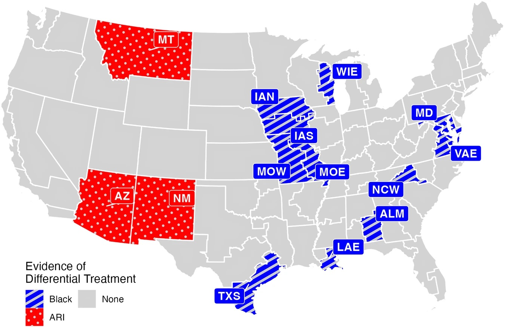

# Additional Results

We saw in our baseline model that, accounting for nothing other than race, Black defendants received on average sentences that were 18.5 months longer than white defendants. Similarly, Hispanic defendants receive sentences that are an average of 5.3 months longer than those of white defendants. Defendants classified as ARI receive sentences that are 9.0 months shorter than white defendants on average. Why might that be? We need to be careful in drawing conclusions from this initial model because we have not yet tried to explain those differences based on other factors, such as year or criminal history.

As we add and consider factors that might explain some of this variation, we expect to see this differential in sentencing length change. In no particular order, the other explanatory variables discussed were added to the model. For example, when demographic information is included, the differential in sentencing length for Black defendants drops by $(18.5 - 12.9) = 5.6$ months. With demographic factors added as independent variables, Black defendants receive on average sentences that are 12.9 months longer than white defendants. In the end, with all explanatory variables included in the District I Model in the original study, the authors found that Black defendants receive sentences on average 1.9 months longer than white defendants and Hispanic defendants receive sentences that are not significanlty different from those of white defendants.

Throughout our analyses, we focused on the multiple $R^2$ value, although the original study appropriately reports the *adjusted* $R^2$. The interpretation is similar, although the adjusted $R^2$ takes a hit relative to the multiple $R^2$ value if predictors are included in the model that do not explain much more of the variation in the outcome. We saw that for the baseline model, the adjusted $R^2$ was just shy of 0.02, meaning that only 2% of the variability in sentence length is explained by race alone. By including all the terms in a model that also includes all the districts (the District I model), the adjusted $R^2$ is reported as 0.79, meaning that 79% of the variability in sentence length is explained by this fuller model. 

The authors further refine the analysis by looking at individual districts rather than the federal court system nationwide in the District II Model, which we partially replicated in this case study. We saw from first column of [Figure 2](https://www.nature.com/articles/s41599-023-01879-5/figures/2) (copied below) that Black defendants receive longer sentences than white defendants in at least 11 districts and ARI defendants receive longer sentences than white defendants in at least 3 districts. 

The authors provide two additional visualizations summarizing their evidence of racial disparities in federal criminal sentencing, focusing in particular on differences in sentence lengths between White defendants and all other races. [Figure 3](https://www.nature.com/articles/s41599-023-01879-5/figures/3) below displays the 95% confidence intervals for the sentence differential, while the final [Figure 4](https://www.nature.com/articles/s41599-023-01879-5/figures/4) below highlights the geographic locations of these districts with sentencing differentials in the U.S. 

